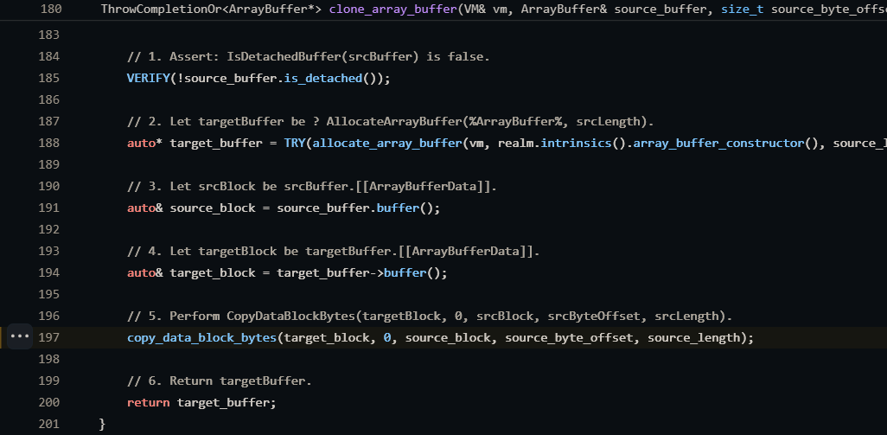
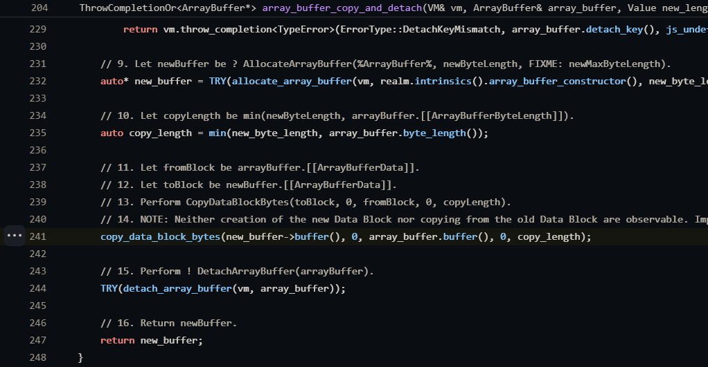
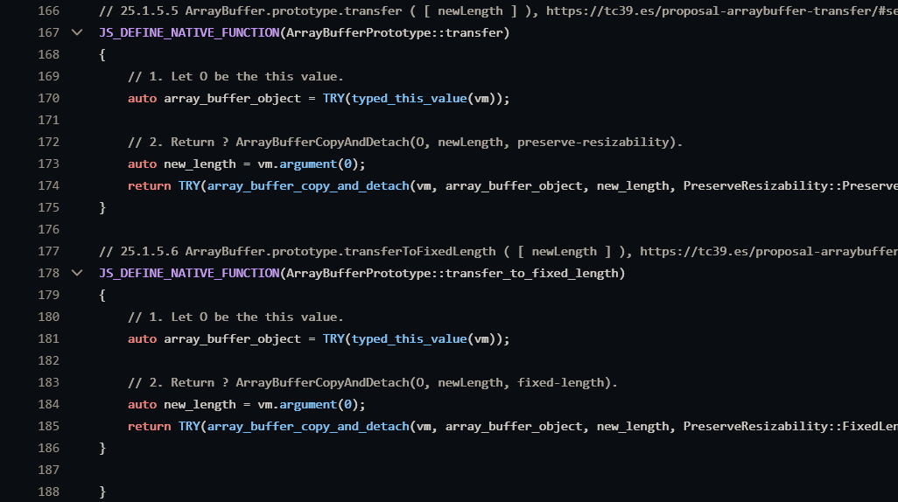
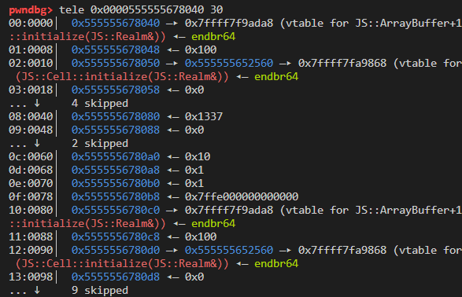
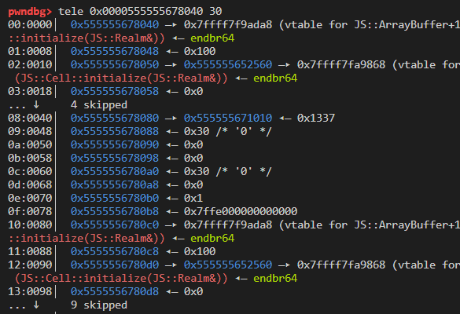
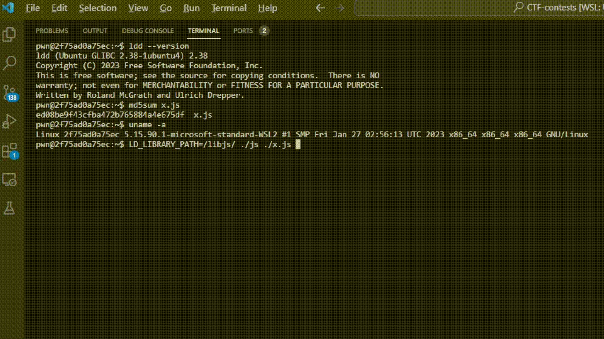

## NIGHTJS

The challenge is a patched version of [Serenity OS](https://github.com/SerenityOS/serenity)'s JS interpreter.

### Patch analysis

I can see that there are multiple patches in this challenge. But I will focus on patches that being applied on ArrayBuffer and ByteBuffer. The other patches are not really important and not really related to the challenge.

So how does it work? Let's check the source code of Serenity LibJS. (Remember to clone down the Serenity OS source code and checkout the commit `799b465fac5672f167d6fec599fe167bce92862d`)

Here I see that the modified section is in function [copy_data_block_bytes](https://github.com/SerenityOS/serenity/blob/master/Userland/Libraries/LibJS/Runtime/ArrayBuffer.cpp#L89), [array_buffer_copy_and_detach](https://github.com/SerenityOS/serenity/blob/master/Userland/Libraries/LibJS/Runtime/ArrayBuffer.cpp#L204) and the [[] operator](https://github.com/SerenityOS/serenity/blob/master/AK/ByteBuffer.h#L105) of ByteBuffer class. Let's start with `copy_data_block_bytes` first.

The function is called by [clone_array_buffer](https://github.com/SerenityOS/serenity/blob/master/Userland/Libraries/LibJS/Runtime/ArrayBuffer.cpp#L197) and [array_buffer_copy_and_detach](https://github.com/SerenityOS/serenity/blob/master/Userland/Libraries/LibJS/Runtime/ArrayBuffer.cpp#L241).

 

Tracing the two function I know that `array_buffer_copy_and_detach` is called in JS Native function defined [transfer](https://github.com/SerenityOS/serenity/blob/master/Userland/Libraries/LibJS/Runtime/ArrayBufferPrototype.cpp#L167) and [transfer_to_fixed_length](https://github.com/SerenityOS/serenity/blob/master/Userland/Libraries/LibJS/Runtime/ArrayBufferPrototype.cpp#L178), since triggering this path is simpler I won't go into `clone_array_buffer`.



What does the `transfer` functions do?

According to the source code, `transfer` basically "move" the internal struct of a ArrayBuffer into another new ArrayBuffer by copying byte by byte.

For example:

```js
a = new ArrayBuffer(0x10)
b = a.transfer(0x10)
```

It will call `array_buffer_copy_and_detach` with second argument as `a` and third argument as the `0x10` (the new ArrayBuffer size).

```cpp
// 25.1.2.14 ArrayBufferCopyAndDetach ( arrayBuffer, newLength, preserveResizability ), https://tc39.es/proposal-arraybuffer-transfer/#sec-arraybuffer.prototype.transfertofixedlength
ThrowCompletionOr<ArrayBuffer*> array_buffer_copy_and_detach(VM& vm, ArrayBuffer& array_buffer, Value new_length, PreserveResizability)
{
    auto& realm = *vm.current_realm();

    // 1. Perform ? RequireInternalSlot(arrayBuffer, [[ArrayBufferData]]).

    // FIXME: 2. If IsSharedArrayBuffer(arrayBuffer) is true, throw a TypeError exception.

    // 3. If newLength is undefined, then
    // a. Let newByteLength be arrayBuffer.[[ArrayBufferByteLength]].
    // 4. Else,
    // a. Let newByteLength be ? ToIndex(newLength).
    auto new_byte_length = new_length.is_undefined() ? array_buffer.byte_length() : TRY(new_length.to_index(vm));

    // 5. If IsDetachedBuffer(arrayBuffer) is true, throw a TypeError exception.
    if (array_buffer.is_detached())
        return vm.throw_completion<TypeError>(ErrorType::DetachedArrayBuffer);

    // FIXME: 6. If preserveResizability is preserve-resizability and IsResizableArrayBuffer(arrayBuffer) is true, then
    // a. Let newMaxByteLength be arrayBuffer.[[ArrayBufferMaxByteLength]].
    // 7. Else,
    // a. Let newMaxByteLength be empty.

    // 8. If arrayBuffer.[[ArrayBufferDetachKey]] is not undefined, throw a TypeError exception.
    if (!array_buffer.detach_key().is_undefined())
        return vm.throw_completion<TypeError>(ErrorType::DetachKeyMismatch, array_buffer.detach_key(), js_undefined());

    // 9. Let newBuffer be ? AllocateArrayBuffer(%ArrayBuffer%, newByteLength, FIXME: newMaxByteLength).
    auto* new_buffer = TRY(allocate_array_buffer(vm, realm.intrinsics().array_buffer_constructor(), new_byte_length));

    // 10. Let copyLength be min(newByteLength, arrayBuffer.[[ArrayBufferByteLength]]).
    auto copy_length = min(new_byte_length, array_buffer.byte_length());

    // 11. Let fromBlock be arrayBuffer.[[ArrayBufferData]].
    // 12. Let toBlock be newBuffer.[[ArrayBufferData]].
    // 13. Perform CopyDataBlockBytes(toBlock, 0, fromBlock, 0, copyLength).
    // 14. NOTE: Neither creation of the new Data Block nor copying from the old Data Block are observable. Implementations may implement this method as a zero-copy move or a realloc.
    copy_data_block_bytes(new_buffer->buffer(), 0, array_buffer.buffer(), 0, copy_length);

    // 15. Perform ! DetachArrayBuffer(arrayBuffer).
    TRY(detach_array_buffer(vm, array_buffer));

    // 16. Return newBuffer.
    return new_buffer;
}
```

Quick explanation on what `array_buffer_copy_and_detach` does. It detaches the internal structures (ByteBuffer, size, content,...) of old ArrayBuffer object and attaches them to new allocated ArrayBuffer.

By default, the `copy_length` at step 10 will be determine by choosing the lower value between new ArrayBuffer size (user controlled) and the size of the buffer that is being moved.

```js

// example 1

a = new ArrayBuffer(0x10)
b = a.transfer(0x100)

// 0x10 < 0x100 so copy_length = 0x10

// example 2

a = new ArrayBuffer(0x30)
b = a.transfer(0x20)

// 0x20 < 0x30 so copy_length = 0x20

```

But with the patch applied.

```patch
@@ -215,6 +215,7 @@ ThrowCompletionOr<ArrayBuffer*> array_buffer_copy_and_detach(VM& vm, ArrayBuffer
 
     // 10. Let copyLength be min(newByteLength, arrayBuffer.[[ArrayBufferByteLength]]).
     auto copy_length = min(new_byte_length, array_buffer.byte_length());
+    if(array_buffer.byte_length() > 0x100) copy_length = array_buffer.byte_length();
 
     // 11. Let fromBlock be arrayBuffer.[[ArrayBufferData]].
     // 12. Let toBlock be newBuffer.[[ArrayBufferData]]
```

If the size of the buffer being moved > 0x100 then `copy_length` value will be determined by it.

```js

// example 1

a = new ArrayBuffer(0x200)
b = a.transfer(0x10)

// array_buffer.byte_length() = 0x200
// array_buffer.byte_length() > 0x100 so copy_length = array_buffer.byte_length()

```

`copy_length` will now be passed to `copy_data_block_bytes`

```cpp
    // 11. Let fromBlock be arrayBuffer.[[ArrayBufferData]].
    // 12. Let toBlock be newBuffer.[[ArrayBufferData]].
    // 13. Perform CopyDataBlockBytes(toBlock, 0, fromBlock, 0, copyLength).
    // 14. NOTE: Neither creation of the new Data Block nor copying from the old Data Block are observable. Implementations may implement this method as a zero-copy move or a realloc.
    copy_data_block_bytes(new_buffer->buffer(), 0, array_buffer.buffer(), 0, copy_length);
```

In the original source code, there are assertions to check if the `index + copy_length` of the buffer being copied is larger than the `size of destination buffer`. If the condition is met then the program will print out stack trace and call `abort()` through `ak_verification_failed`.

```cpp
void copy_data_block_bytes(ByteBuffer& to_block, u64 to_index, ByteBuffer const& from_block, u64 from_index, u64 count)
{
    // 1. Assert: fromBlock and toBlock are distinct values.
    VERIFY(&to_block != &from_block);

    // 2. Let fromSize be the number of bytes in fromBlock.
    auto from_size = from_block.size();

    // 3. Assert: fromIndex + count ≤ fromSize.
    VERIFY(from_index + count <= from_size);

    // 4. Let toSize be the number of bytes in toBlock.
    auto to_size = to_block.size();

    // 5. Assert: toIndex + count ≤ toSize.
    VERIFY(to_index + count <= to_size);

    // 6. Repeat, while count > 0,
    while (count > 0) {

        ...

        // ii. Set toBlock[toIndex] to fromBlock[fromIndex].
        to_block[to_index] = from_block[from_index];

        // c. Set toIndex to toIndex + 1.
        ++to_index;

        // d. Set fromIndex to fromIndex + 1.
        ++from_index;

        // e. Set count to count - 1.
        --count;
    }

    // 7. Return unused.
}
```

But then the patch cleared out the check.

```patch
@@ -80,10 +80,10 @@ void copy_data_block_bytes(ByteBuffer& to_block, u64 to_index, ByteBuffer const&
     VERIFY(from_index + count <= from_size);
 
     // 4. Let toSize be the number of bytes in toBlock.
-    auto to_size = to_block.size();
+    // auto to_size = to_block.size();
 
     // 5. Assert: toIndex + count ≤ toSize.
-    VERIFY(to_index + count <= to_size);
+    // VERIFY(to_index + count <= to_size);
```

Finally the `[] operator` patch, if you noticed you will realise `copy_data_block_bytes` not only has ByteBuffer-typed argument, but also access ByteBuffer's data later through `[] operator`.

```cpp
to_block[to_index] = from_block[from_index];
```

This is the reason why this patch is applied:

```patch
     [[nodiscard]] u8& operator[](size_t i)
     {
-        VERIFY(i < m_size);
+        // VERIFY(i < m_size);
         return data()[i];
     }
```

### Vulnerability

So with the patches applied, what can I do with it?

If you're familiar with userland heap-based attacks, you'll immediately recognize this is a heap buffer overflow. But there are some thing I need to pay attention to before making an attack strategy.

This is a ArrayBuffer typed object, so of course I can not randomly overflow the heap with 0x4141414141414141 :D

So I go read the source code and compare it with the heap layout to be clear about the internal members of ArrayBuffer.

- [ArrayBuffer](https://github.com/SerenityOS/serenity/blob/master/Userland/Libraries/LibJS/Runtime/ArrayBuffer.h#L49)

- [DataBlock](https://github.com/SerenityOS/serenity/blob/master/Userland/Libraries/LibJS/Runtime/ArrayBuffer.h#L31)

- [ByteBuffer](https://github.com/SerenityOS/serenity/blob/1b2007cc7f02ccb043abf39adbfa8276089bfa00/AK/ByteBuffer.h#L20)

```cpp
class ByteBuffer {
public:
    ByteBuffer() = default;

    ~ByteBuffer()
    {
        clear();
    }

    ...

private:

    ...

    union {
        u8 m_inline_buffer[inline_capacity];
        struct {
            u8* m_outline_buffer;
            size_t m_outline_capacity;
        };
    };
    size_t m_size { 0 };
    bool m_inline { true };
};

...

// 6.2.9 Data Blocks, https://tc39.es/ecma262/#sec-data-blocks
struct DataBlock {
    enum class Shared {
        No,
        Yes,
    };

    ByteBuffer& buffer()
    {
        ByteBuffer* ptr { nullptr };
        byte_buffer.visit([&](Empty) { VERIFY_NOT_REACHED(); }, [&](auto* pointer) { ptr = pointer; }, [&](auto& value) { ptr = &value; });
        return *ptr;
    }
    ByteBuffer const& buffer() const { return const_cast<DataBlock*>(this)->buffer(); }

    Variant<Empty, ByteBuffer, ByteBuffer*> byte_buffer;
    Shared is_shared = { Shared::No };
};

class ArrayBuffer : public Object {
    JS_OBJECT(ArrayBuffer, Object);

public:

    ...

private:
    ArrayBuffer(ByteBuffer buffer, Object& prototype);
    ArrayBuffer(ByteBuffer* buffer, Object& prototype);

    virtual void visit_edges(Visitor&) override;

    DataBlock m_data_block;
    // The various detach related members of ArrayBuffer are not used by any ECMA262 functionality,
    // but are required to be available for the use of various harnesses like the Test262 test runner.
    Value m_detach_key;
};
```

By observing the source code you see that the content buffer of ByteBuffer is handled in two way. inline or outline.

With the inline type the program will use the 32-byte-long inline buffer to store data. Else, the outline buffer will be used with the first qword is buffer pointer, the next qword is the outline buffer size.

So let's compared the struct

```cpp
    union {
        u8 m_inline_buffer[inline_capacity];
        struct {
            u8* m_outline_buffer;
            size_t m_outline_capacity;
        };
    };
    size_t m_size { 0 };
    bool m_inline { true };
```

with the heap layout (you can get the ArrayBuffer address pointer by type-cast it into int arrays).

Heap layout of `a = new ArrayBuffer(0x10)`



What I know by looking at the heap layout:

- lots of vtable initalized at the start of the struct.

- inline buffer starts at `0x555555678080`.

- inline buffer size at `0x5555556780a0`.

- m_inline (a inline switch) at `0x5555556780a8`.

- type enum Variant (Empty, ByteBuffer, ByteBuffer) at `0x5555556780b0`, this is just used to let js know how to access the ByteBuffer properly or is it a Empty type (deteched) and I won't need to care about it, just leave it as default.

Heap layout of `a = new ArrayBuffer(0x30)`



Noticablely everything else (vtable, type enum, ...) stays the same except for the inline switch (now turned off to 0) and the content now being saved into another outline buffer at `0x555555678080` which size saved at `0x555555678088`.

### Attack strategy

With all the knowledges observed, I will now make an attack plan.

- Create a ArrayBuffer with size larger than 0x100 and properly set fake m_inline, type enum, inline size.

- Trigger the overflow into a newly ArrayBuffer which used inline buffer (I call ArrayBuffer `B`). Now b's original inline size is overwritten with the value I set at previous step.

- With the ArrayBuffer size modified, I will leak vtable, heap pointer through `B`.

- Having heap pointer leaked, I will create a ArrayBuffer with size 0x1000, spray it with "A"s and call transfer on it to have the heap chunk freed, then I search for "A"s pattern through `B` and leak the main_arena/libc address (since the freed chunk will go into unsortedbin)

- Now I create another ByteArray inline-typed buffer (I call ArrayBuffer `C`), fill it with "B"s and search for the pattern through `B` again to know where the `C` lies in the heap.

- Having known where `C` is, I modified its m_inline switch to outline buffer and points address of outline buffer to `environ` to leak stack.

- I abuse the read/write what where primitive in previous step to create a ROP chain on stack and profit!



Exploit script avaiable at [my github](https://github.com/th3-5had0w/CTF-contests/blob/master/ASIS2023/night/x.js)

The environment, heap layout between the process being traced by gdb debugger and normal process is a lot different, so when I need to debug the script by attaching debugger method I add `for (;;);` to it, hope it helps.

And finally I want to thank `SlidyBat` to help me get used with this new field.

References:

- https://github.com/SerenityOS/serenity

- https://tc39.es/ecma262