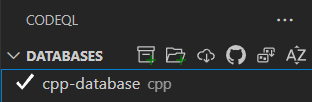
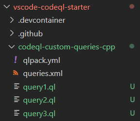
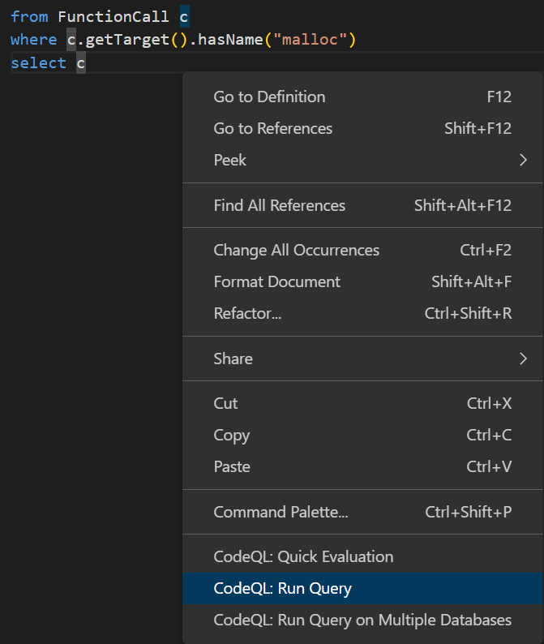
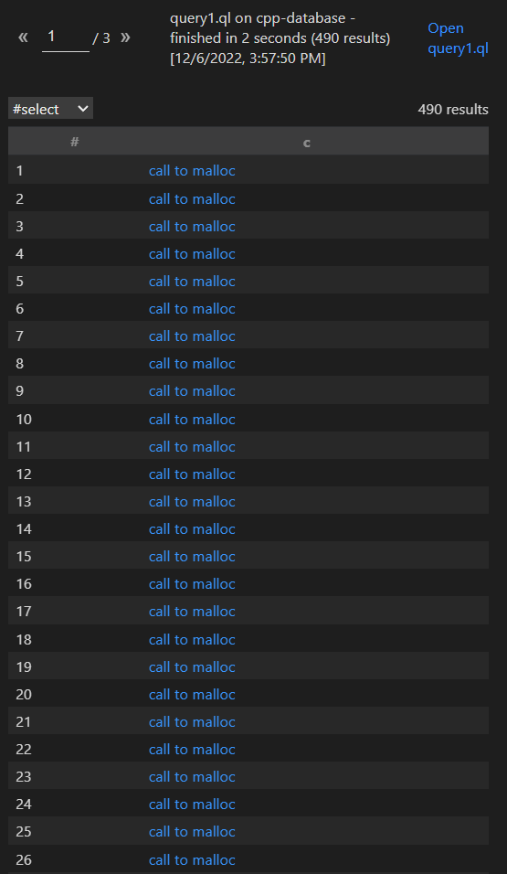
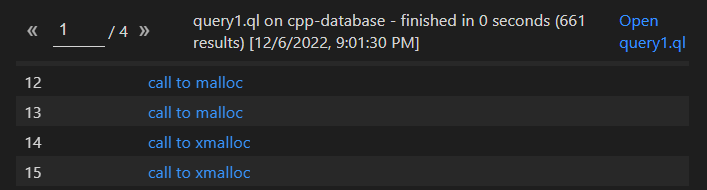
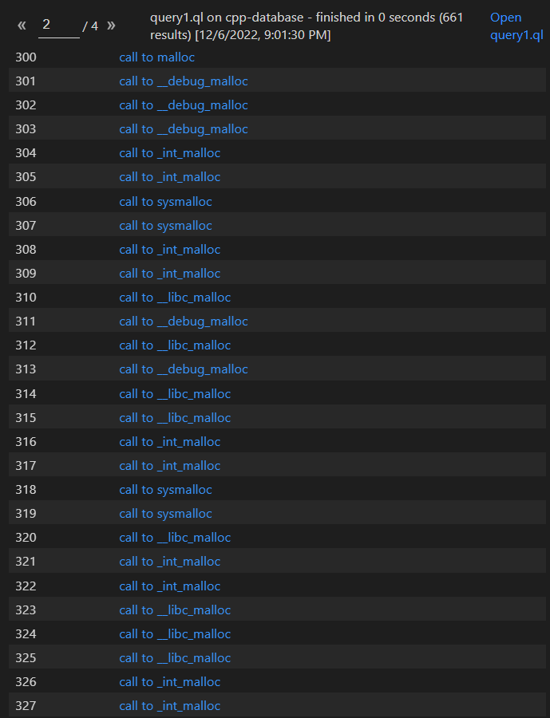
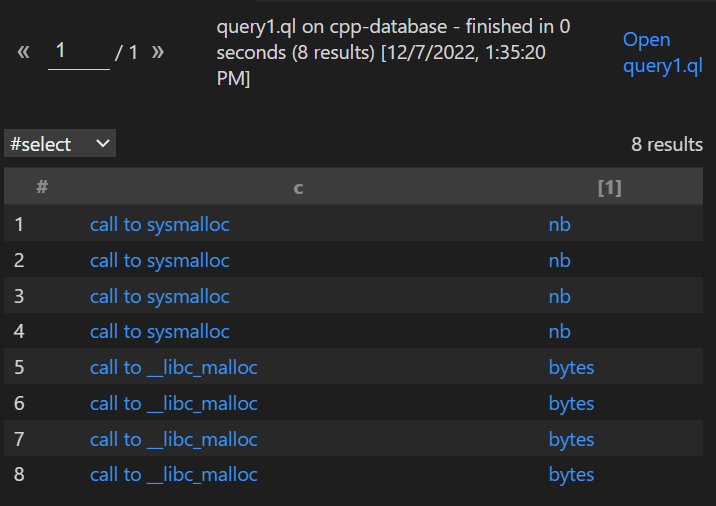
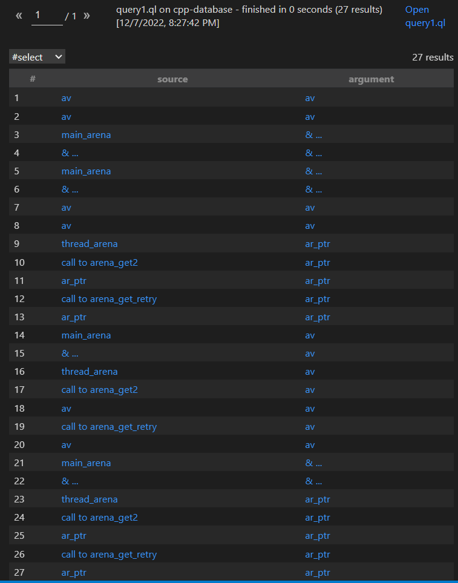
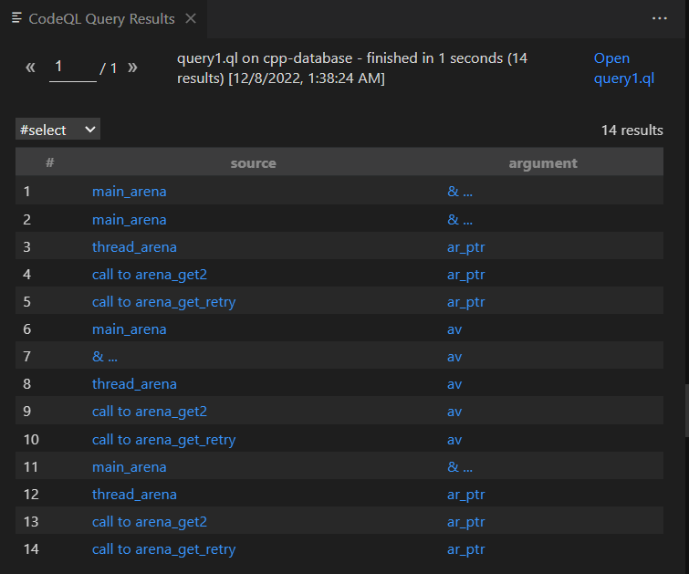

As the source codes being more and more complex these days, the way we search for functions, arguments with patterns in code editors is inconvenient. There's another better way to help you achieve that goal...

## Introduction

CodeQL is a query language that helps you search for critical things in the source code with your own constraints, I've just got to know about it recently. So this series will be me noting things I've learnt while using CodeQL to automate source code auditing. It might be helpful for those tired of searching code patterns in massive codebase.

## Environment setup

Setting up the environment is pretty basic, we need to have these things for a properly working CodeQL environment:

- CodeQL (of course) - I'll be using CodeQL Visual Studio Plugin, you could search for it in [vscode extension store](https://marketplace.visualstudio.com/items?itemName=GitHub.vscode-codeql)

- [A CodeQL workspace to use with Visual Studio CodeQL plugin.](https://github.com/github/vscode-codeql-starter/)

- A database that so that you could run queries against it.

For the CodeQL vscode plugin and the workspace, I suggest follow the instructions in the links above.

About the database, I will choose [Glibc-2.35](https://ftp.gnu.org/gnu/glibc/glibc-2.35.tar.gz) as the source auditing target. To build the [Glibc source as the database](https://codeql.github.com/docs/codeql-cli/creating-codeql-databases/), you need to get the codeql-cli binary [here](https://github.com/github/codeql-cli-binaries/releases).

Now for the build part:
```
5439 Sarmat λ  (~/Desktop/codeql-playground)
 $ ls
codeql-linux64  glibc-2.35.tar.gz

5439 Sarmat λ  (~/Desktop/codeql-playground)
 $ tar xf glibc-2.35.tar.gz 

5439 Sarmat λ  (~/Desktop/codeql-playground)
 $ cd glibc-2.35/

5439 Sarmat λ  (~/.../codeql-playground/glibc-2.35)
 $ mkdir build && cd build

5439 Sarmat λ  (~/.../codeql-playground/glibc-2.35/build)
 $ ../configure
```

After configuring the source, we will now generate CodeQL database for the source with:
```
../../codeql-linux64/codeql/codeql database create <your-database-name> --language=cpp --command=make
```

I use the default name for database cpp-database. After the above command had ran successfully you will see a folder that has the same name as your database name you defined in the command line above. For me it's cpp-database, this folder will now be used as the database for you to run queries on. You could leave it be and add it as the folder or compress it and add it as an archive. Personally I compress the database because it's easy to transfer between VMs and hosts.

If you successfully added the database to CodeQL plugin the database will appear like this



## "Hello! Who's calling me?"

> * Note: Like I said, I've just got to know about CodeQL recently so my explainations for the queries might not be so accurate, so if you notice some thing I won't correctly explain please let me know. Thanks.

So after had set up the environment, now we will write the query in the CodeQL workspace. I suggest you place your queries in `codeql-custom-queries-cpp` folder like this.



So let's start with a basic query that will return to us every single place in the Glibc source code that calls `malloc`:

```sql
import cpp

from FunctionCall c
where c.getTarget().hasName("malloc")
select c
```

The query above return back to us places where the `Function` being called (target function) has the name "`malloc`".

You can see because CodeQL is a query language so its syntax is somewhat familiar to SQL.



Run it, if nothing goes wrong the result should look like this:



I suggest you should stop here. Play around a little with the result (I mean click it and see where it leads you to) to have a better understanding of the query.

There is no "proper" way to write these kind of queries, you can do it however you want. Below is another query which have the same functionality, check it result for comparison:

```sql
import cpp

from FunctionCall c
where c.getTarget().getName() = "malloc"
select c
```

Now I want to add some filter to make the query result more accurate:

```sql
import cpp

from FunctionCall c
where c.getTarget().getName().regexpMatch(".*malloc")
select c
```

My query search for places where those `Function` being called (target function) has "`malloc`" as its suffix. We shall check the result to confirm what I've just explained.





You could add more constraint to your filter using the keyword `or`, `and`.

For some reason, I don't want to query those "`xmalloc`", I edited my query:

```sql
import cpp

from FunctionCall c
where c.getTarget().getName().regexpMatch(".*malloc")
and c.getTarget().getName() != "xmalloc"
select c
```

Run the query and there shouldn't be any xmalloc in the result.

But the result is still enormous in number, and I'm not satisfied. So I will narrow down the range of the result once more:

```sql
import cpp

from FunctionCall c
where c.getTarget().getName().regexpMatch(".*malloc")
and c.getFile().getBaseName() = "malloc.c"
and c.getArgument(0).getUnderlyingType() instanceof IntegralType
select c, c.getArgument(0)
```

So here I query places where those `Function` being called (target function) has "`malloc`" as its suffix but only in the file named "`malloc.c`" and first argument is `int` type. The result looks very promising.



Next I will write some queries to play around with flow analysing.

## "My dear! Where are you going?"

Below is a script that query the "local program flow", meaning it will query the references and relations between some specific functions, arguments in the same scope of a function:

```sql
import cpp
import semmle.code.cpp.dataflow.DataFlow

from FunctionCall fc, Expr source
where fc.getTarget().getName().matches("%_int_malloc%")
and DataFlow::localFlow(DataFlow::exprNode(source), DataFlow::exprNode(fc.getArgument(0)))
select source, fc.getArgument(0) as argument
```

There are some new function DataFlow::localFlow, DataFlow::exprNode you might haven't seen before. The `DataFlow::exprNode` converts a expression (`Expr` type) to a `Node` type data because `DataFlow::localFlow` takes 2 arguments with `Node` type according to the document:

```
localFlow(Node source, Node sink)

Holds if data flows from "source" to "sink" in zero or more local (intra-procedural) steps
```

The `source` (Node type) and the `sink` (Node type). Just think the `source` and `sink` like the start point and the end point of a pipe, in that pipe the data flows.

So what am I doing with my script?

Just a glance at it and you could see that the `source` only have one constraint (the `source` must have it's "end" some relation with first argument of `_int_malloc` calls), playing around with the result might help you understand what I say because it's pretty abstract @@



So look here you might see some pair of `source` and `sink` that is the same, meaning it also return when the variable "flows" to itself, so I made a small change in the script:

```sql
import cpp
import semmle.code.cpp.dataflow.DataFlow

from FunctionCall fc, Expr source
where fc.getTarget().getName().matches("%_int_malloc%")
and DataFlow::localFlow(DataFlow::exprNode(source), DataFlow::exprNode(fc.getArgument(0)))
and source.toString() != fc.getArgument(0).toString()
select source, fc.getArgument(0) as argument
```



You can see all of those useless pair has disappeared.

Until now you have learnt how to query out the data flow. This should help much in real life scenarios where you need to see which parameter that you control will go where. Think of this:

1. I have some input data.

2. My input data will be parsed through a function called `parse_data()`.

3. The parsed data will be saved to a buffer named `parsedData`.

4. And that `parsedData` buffer will be passed to some more function here and there, which will take much time to do pattern searching as usual.

5. With the help of `DataFlow::localFlow` I will be able to track accurately which function uses that `parsedData` buffer that was parsed from my initial input.

> * Note: What I've just showed you is a real life case which I will show you in the next series.

For now we will learn about something more interesting.

## "Hey! How the hell did you get here?"

You've known how to track the data flow with the help of `DataFlow::localFlow`, but the problem is the flow you tracked is only in a function scope, so any data flow outside of that function will not be listed. But do not worry my friend, the only thing that is limited is our mind.

To start up with this I will introduce you `Class` usage in CodeQL.

To use the global flow we have to inherit its configuration and redefine our own source and sink filter.

```sql
import cpp
import semmle.code.cpp.dataflow.TaintTracking
import DataFlow::PathGraph

class MySource extends FunctionCall {
    MySource()
    {
        this.getTarget().getName().regexpMatch(".*malloc")
    }
}

class MySink extends FunctionCall {
    MySink()
    {
        this.getTarget().getName().regexpMatch(".*printf")
    }

    Expr assertCondition()
    {
        result = this.getArgument(0)
    }
}

class Config extends TaintTracking::Configuration {
    Config() { this = "config" }
    
    override predicate isSource(DataFlow::Node node) {
        exists(MySource source |
            node.asExpr() = source)
    }
    
    override predicate isSink(DataFlow::Node node) {
        exists(MySink sink |
            node.asExpr() = sink.assertCondition())
    }
}

from Config config, DataFlow::PathNode sink, DataFlow::PathNode source
where config.hasFlowPath(source, sink)
select "source --> magical procssing steps --> sink" as dataflow, source, sink
```

"WTF is this mess??" - I know you're saying that. But stay still, I will explain it right away =]]

So you can see I'm using `MySource` and `MySink` classes that inherit the `FunctionCall` class, the reason for that is simple, I need to use those methods in `FunctionCall` in my child classes. The same reason for `Config` class that inherits the `TaintTracking::Configuration`, in my `Config` class I need to override the `isSource` and `isSink` function, I also have to cast `node.asExpr()` because I'm comparing with an expression.

According to the document:

```
* isSource - defines where data may flow from

* isSink - defines where data may flow to
```

I redefine these 2 function with my own constraints:

* Source: select all those being called function with `malloc` in its name's suffix.

* Sink: select all those being called function with `print` in its name's suffix `AND` select the first argument from those function.

These 2 constraints combined together will create:

* Select all those return value of `those being called function with malloc in its name's suffix` which will end up in `the first argument of those being called function with `print` in its name's suffix`

You could confirm this with the query result.

```
Source ---> Magical multiple steps ---> Sink
```

The "Magical multiple steps" is the reason why some pairs in the listed results doesn't really seem to have any relation. It's only show you the start point and the end point of data flow. To track those magical steps we'll get to another concept.

## "Would you tell me, please, which way I ought to go from here?"

`isAdditionalTaintStep` allows you to add more constraint to the flowing path of the flow.

```
Holds if taint may propagate from node1 to node2 in addition to the normal data-flow and taint steps.

predicate isAdditionalTaintStep(Node node1, Node node2)
```

So if you define isAdditionalTaintStep, the result listed will make sure the data will some how flows from Node1 to Node2. Meaning:

```
Source ---> Magical multiple steps ---> (Node1 ---> Node2) ---> Magical multiple steps ---> Sink
```

The constraint lies somewhere between the "magical steps". As an example:

```sql
import cpp
import semmle.code.cpp.dataflow.TaintTracking
import DataFlow::PathGraph

class MySource extends FunctionCall {
    MySource()
    {
        this.getTarget().getName().regexpMatch(".*malloc")
    }
}

class MySink extends FunctionCall {
    MySink()
    {
        this.getTarget().getName().regexpMatch(".*printf")
    }

    Expr assertCondition()
    {
        result = this.getArgument(0)
    }
}

class AdditionalStep extends FunctionCall {
    AdditionalStep()
    {
        this.getTarget().getName().regexpMatch("memcpy")
    }

    Expr assertCondition1()
    {
        result = this.getArgument(0)
    }

    Expr assertCondition2()
    {
        result = this.getArgument(1)
    }
}

class Config extends TaintTracking::Configuration {
    Config() { this = "config" }
    
    override predicate isSource(DataFlow::Node node) {
        exists(MySource source |
            node.asExpr() = source)
    }
    
    override predicate isSink(DataFlow::Node node) {
        exists(MySink sink |
            node.asExpr() = sink.assertCondition())
    }

    override predicate isAdditionalTaintStep(DataFlow::Node fromNode, DataFlow::Node toNode) {
        exists(
            AdditionalStep ac | fromNode.asExpr() = ac.assertCondition2()
            and toNode.asExpr() = ac.assertCondition1()
        )
    }
}

from Config config, DataFlow::PathNode sink, DataFlow::PathNode source, DataFlow::Node fromNode, DataFlow::Node toNode
where config.hasFlowPath(source, sink)
and config.isAdditionalTaintStep(fromNode, toNode)
select "source --> magical thing --> sink" as dataflow, source, fromNode, sink
```

I suggest you read the query with [the document](https://codeql.github.com/codeql-standard-libraries/) and then try editing the script to add your own constraint to understand it better, if you've read until now then I think analyze my query won't be so hard:

The new constraint I added to my query is:

```
something data returned from *malloc() --> magic --> second argument of memcpy() --> first argument of memcpy() --> magic --> first argument of *printf()
```

## "Nuh-uh, I left the ending ambiguous..."

So you could add multiple constraint to guide the result which flow should be listed, how about a constraint where the flow will be blocked? Let's get familiar with `isSanitizer`.

```
Holds if the node node is a taint sanitizer.

predicate isSanitizer(Node node)
```

To redefine `isSanitizer` is to create how you want to block the dataflow when the flow reaches `node`.

Take a look at this:

```sql
import cpp
import semmle.code.cpp.dataflow.TaintTracking
import DataFlow::PathGraph

class MySource extends FunctionCall {
    MySource()
    {
        this.getTarget().getName().regexpMatch(".*malloc")
    }
}

class MySink extends FunctionCall {
    MySink()
    {
        this.getTarget().getName().regexpMatch(".*printf")
    }

    Expr assertCondition()
    {
        result = this.getArgument(0)
    }
}

class BlockPath extends FunctionCall {
    BlockPath()
    {
        this.getTarget().hasName("free")
    }

    Expr assertCondition()
    {
        result = this.getArgument(0)
    }
}

class Config extends TaintTracking::Configuration {
    Config() { this = "config" }
    
    override predicate isSource(DataFlow::Node node) {
        exists(MySource source |
            node.asExpr() = source)
    }
    
    override predicate isSink(DataFlow::Node node) {
        exists(MySink sink |
            node.asExpr() = sink.assertCondition())
    }

    override predicate isSanitizer(DataFlow::Node node) {
        exists(BlockPath bp | bp.assertCondition() = node.asExpr()
        )
    }
}

from Config config, DataFlow::PathNode sink, DataFlow::PathNode source
where config.hasFlowPath(source, sink)
select "source --> magical thing --> sink" as dataflow, source, sink
```

The above query will list only list those flows which the data don't flow through the first argument of `free`. These kind of flows will not be listed:

```
Source ---> Magical multiple steps ---> free(node) -X-> Magical multiple steps ---> Sink
                                                    ^
                                             stop right here
```

You could also list the stop point of the flow with this query below:

```sql
import cpp
import semmle.code.cpp.dataflow.TaintTracking
import DataFlow::PathGraph

class MySource extends FunctionCall {
    MySource()
    {
        this.getTarget().getName().regexpMatch(".*malloc")
    }
}

class MySink extends FunctionCall {
    MySink()
    {
        this.getTarget().getName().regexpMatch(".*printf")
    }

    Expr assertCondition()
    {
        result = this.getArgument(0)
    }
}

class BlockPath extends FunctionCall {
    BlockPath()
    {
        this.getTarget().hasName("free")
    }

    Expr assertCondition()
    {
        result = this.getArgument(0)
    }
}

class Config extends TaintTracking::Configuration {
    Config() { this = "config" }
    
    override predicate isSource(DataFlow::Node node) {
        exists(MySource source |
            node.asExpr() = source)
    }
    
    override predicate isSink(DataFlow::Node node) {
        exists(MySink sink |
            node.asExpr() = sink.assertCondition())
    }

    override predicate isSanitizer(DataFlow::Node node) {
        exists(BlockPath bp | bp.assertCondition() = node.asExpr()
        )
    }
}

from Config config, DataFlow::PathNode sink, DataFlow::PathNode source, DataFlow::Node blockNode
where config.hasFlowPath(source, sink)
and config.isSanitizer(blockNode)
select "source --> blockNode -x-> sink" as dataflow, source, blockNode
```

## Summary

So I think I have introduced you almost all basic queries and concepts of CodeQL. In the next chapters I will show you how I use CodeQL in real world scenarios or in some CTF challenges, and of course I'll be happy to present to you more concepts that I will learn more like macro invocation, relational expression...

That's all I have for you today, thank you for reading. If I explained anything wrong please feel free to correct me by contact me through telegram [@th3_5had0w](https://t.me/th3_5had0w), because as I said at the beginning of this post, I've just got to know about CodeQL recently and still have a lot to learn.