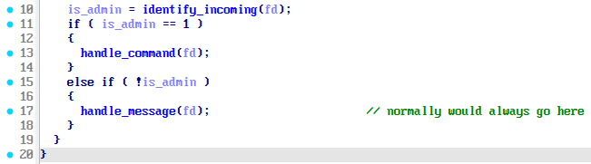
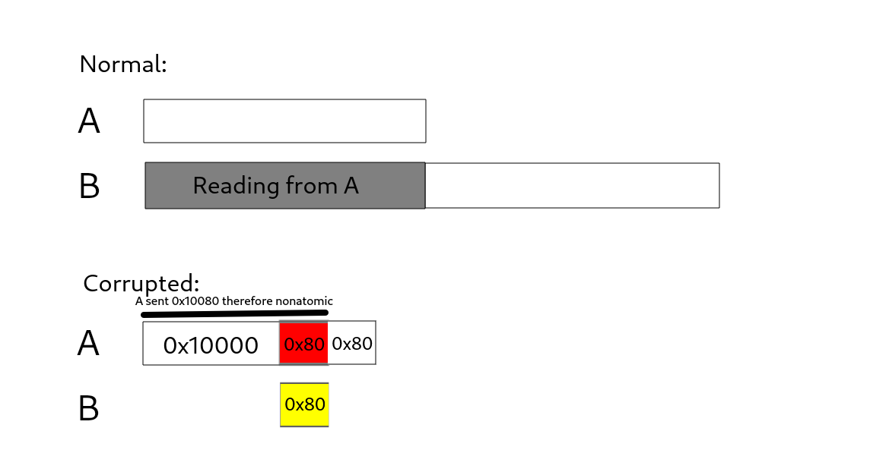
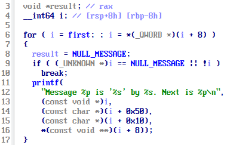
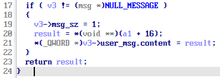

## Ducts

The challenge is a communication server which involving exchanging data between multiple parent/child processes. I could not finish it in time due to not believing my suspicion about the bug, if I could've done better... But personally I think this is a well designed challenge. So here is the write-up of it.

### Vulnerability

After I vividly checked through all the functionality and did not see any logical bug. I noticed a branch which will never be jumped into if nothing goes wrong.



Another weird thing about this program is it passes the user-sent data to the backend processing child fork through a pipe, but the program allows up to 5 users. It was at this moment that I started to be suspicious about the [multiple producers - single consumer channel](https://doc.rust-lang.org/stable/std/sync/mpsc/index.html) being setup in the program.

I did know that the max data buffered size for a single read/write operation on a pipe is 0x10000 but I did not know (I'm not so sure) that multiple read/write operations between a producer and the consumer is non-atomic. So as what I was imagine the bug will exist in this scenario:



So A sent 0x10080 bytes therefore the operation will not be atomical. So B could just hop right in between and fill the last 0x80 bytes. So the next 0x80 bytes of A will actually be a user-faked message, given that primitive we could forge arbitrary commands/messages.

I wish I read the [pipe manpage](https://man7.org/linux/man-pages/man2/pipe.2.html) sooner. After failed racing a few times I thought I had a bad suspicion so I went back to continue finding the logic bug without knowing that what I theoretically thought was correct.

### Attack strategy

The NULL_PTR leak was easy, I just need to create a message and use print command, the next pointer will immediately be the NULL_PTR's address.

Will the NULL_PTR leaked I got PIE base address, I then leak the libc through GOT addresses.

I used fork's GOT address to leak libc base address. But before that I needed to prepare something.

```c
struct user_msg
{
    char username[64];
    char content[sizeof(usr_msg)];
};

struct msg
{
    uint32_t is_admin;
    uint32_t msg_sz;
    uint64_t next;
    struct user_msg user_msg;
};
```

A msg send from user will have the above struct, normally the next ptr is 0. But we could forge a fake next pointer to actually do suspicious stuffs.

To leak the fork's libc address address I will place fork at offset of msg->user_msg and use the print cmd so the fork's libc address will be treated as %s.

But when to use print cmd I need to clean out the next_ptr, because on the GOT table is all .text section of libc, print cmd will keep dereferencing those pointer until the next is 0 or the next equals NULL_PTR's address, but before reaching one of those conditions the program will inevitably crash due to invalid pointer dereference.



So I crafted another fake message with next pointer pointing to `((fork_got_address - 0x50 + 0x8) - 0x50)` and used the redact cmd to clean out the pointer at `(fork_got_address - 0x50 + 0x8)` (which is memcpy got address which now is `*(uint64_t *)&msg->user_msg`)



With that accomplished I now leaked libc base address (There is actually another approach which is allocate a 0x21000 msg size and guess the libc address but the reliablity is quite low which was kinda insipid so I tried a this approach, a little more work but more stable)

I again use the strategy to write system into GOT table and profit.

Resource:

- [x.py](./x.py)

- [idadb](./ducts.i64)

Finally I want to personally thank [Matteo Schiff](https://x.com/matteo_schiff) for having designed a good challange.