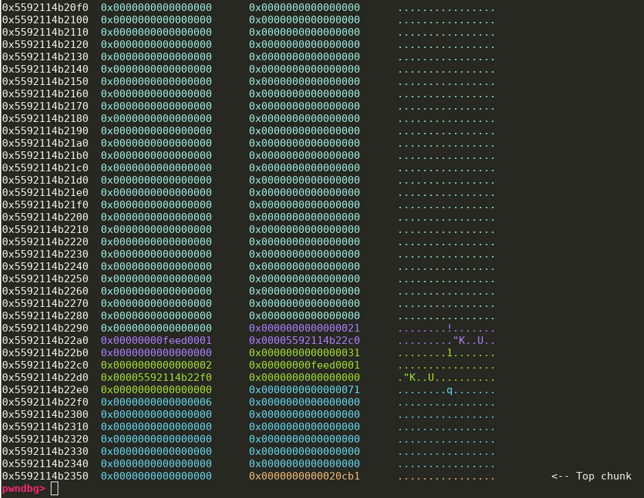

## selfcet

### Vulnerability

Mitigations:

```bash
Arch:     amd64-64-little
RELRO:    Full RELRO
Stack:    Canary found
NX:       NX enabled
PIE:      No PIE (0x400000)
```

Vulnerability:

```c
typedef struct {
  char key[KEY_SIZE];
  char buf[KEY_SIZE];
  const char *error;
  int status;
  void (*throw)(int, const char*, ...);
} ctx_t;
```

The program allows overwriting the others struct members and return address by overflow `key` and `buf`.

### Attack idea

Intended:


Unintended:

By default the throw function pointer is set to error

```c
ctx_t ctx = { .error = NULL, .status = 0, .throw = err };
```

I overwrote the last 12 bit of err to so it points to `warnx` instead with edi (.error) points to GOT to achieve a leak.

Since `main` do not have endbr64 at the start I abuse the [on_exit](https://elixir.bootlin.com/glibc/latest/source/stdlib/stdlib.h#L749) to add `main` to the list of exit routines.

After getting back to `main`, now with libc leaked, I execute `gets` on bss to save `/bin/sh` string (since .error only use 32 bits, using `/bin/sh` from libc is not available) and finally call `system('/bin/sh')`.

Solve script [here](https://github.com/th3-5had0w/CTF-contests/blob/master/seccon2023/selfcet/x.py)

## DataStore1

### Vulnerability

There is an off-by-one in the array indexing functionality.

```c
unsigned idx = getint();
if(idx > arr->count)
	return -1;
```

### Attack idea

The vulnerability above allows removing or adding one more data struct pass the ending of the data array struct. According to the heap layout in the program below



We have the ability to manipulate the next adjacent heap chunk's metadata. So what now?

One trivial thing about the scanf malloc below, it actually allocs one chunk with size 0x70 at the beginning with `malloc()` and then it will realloc the chunk down to the length of our input.

```c
scanf("%70m[^\n]%*c", &buf);
```

So my attack strategy is to first create a string member and then use the data of previous adjecent chunk to overwrite the `arr->count` member of next adjecent array data structure and create in order to create a heap layout that looks like this.


Of course the heap layout above is for demonstration purpose, it's a suggestion, you don't have to do exactly the same.

After setting up the heap layout like this we will abuse the corrupted array structure to overwrite the string size info something big, then we achieve an heap buffer overflow with the content heap chunk.

Now with the buffer overflow primitive. We can leak the heap pointer by modifying the data type of array or string into int.

With heap pointer leaked, we can also leak libc, stack, and finally use ROP chain to spawn the shell.

Solve script [here](https://github.com/th3-5had0w/CTF-contests/blob/master/seccon2023/DataStore1/x.py), I suggest you should do it on your own because my script is not really clear (spaghetti code :v), I mean my heap layout is a little bit complex and just use for reference purpose.