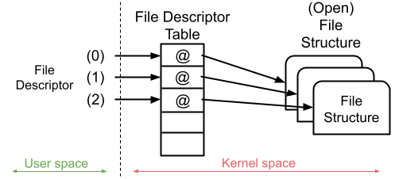
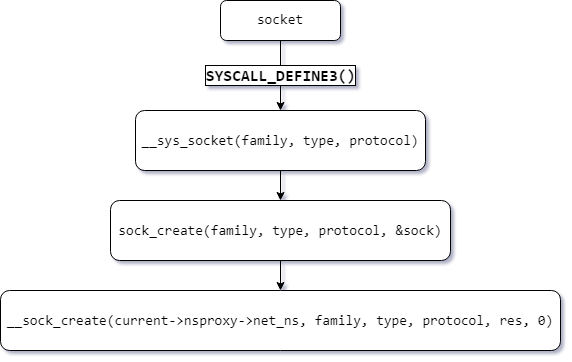
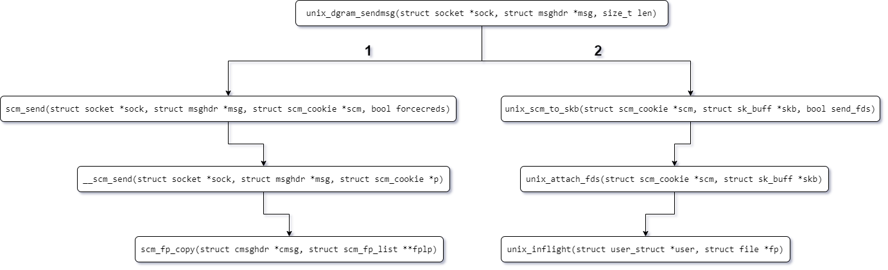
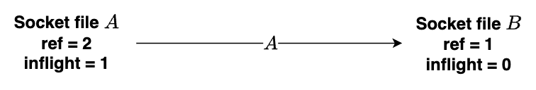
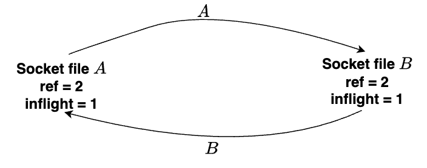
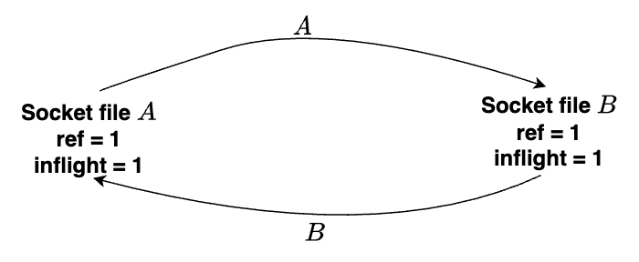

Truyện ngắn về anh công nhân dọn rác cần mẫn trong thế giới màu nhiệm...

Post này được viết dựa trên Linux kernel [5.15.88](https://git.kernel.org/pub/scm/linux/kernel/git/stable/linux.git/tag/?h=v5.15.88)

## "Triết lý" cơ bản trong họ hàng nhà Unix?

"Everything is a file" - họ nhà Unix coi tất cả mọi event xử lý I/O đều dưới dạng một "file". Có nghĩa là để giao tiếp hay thực hiện mọi event xử lý Input hay Output ví dụ như tương tác với các file text, hard-drives, modems, bàn phím, chuột, máy in, màn hình hay một số phương thức liên kết mạng, liên kết giữa các process với nhau (IPC) thì hệ thống Unix đều sẽ có một "file" để đứng ra làm "người đại diện" cho một event I/O nào đó. Hiểu đơn giản hơn là với mỗi một đơn vị I/O chịu trách nhiệm cho một phần nào đó mà có thể tương tác được thì đều sẽ có một "file" tương ứng đứng ra làm interface cho đơn vị I/O đó. Để hiểu rõ hơn hãy xem một số ví dụ ở phần đọc dưới.

## References count

Trong linux, Khi mở một file, kernel sẽ sử dụng file structure để represent cho file đó. Ở trên userland thì khi invoke thành công các hàm khởi tạo network socket hoặc họ hàng của function open() như open, openat,... \[1\] sẽ trả về cho ta một số nguyên gọi là file descriptor number (thông thường là lớn hơn 2 vì 0 là standard input, 1 là standard output, 2 là standard error output). File descriptor number đó sẽ được sử dụng để index vào table [struct files_struct](https://elixir.bootlin.com/linux/v5.15.88/source/include/linux/fdtable.h#L49).

```cpp
/*
 * Open file table structure
 */
struct files_struct {
  /*
   * read mostly part
   */
	atomic_t count;
	bool resize_in_progress;
	wait_queue_head_t resize_wait;

	struct fdtable __rcu *fdt;
	struct fdtable fdtab;
  /*
   * written part on a separate cache line in SMP
   */
	spinlock_t file_lock ____cacheline_aligned_in_smp;
	unsigned int next_fd;
	unsigned long close_on_exec_init[1];
	unsigned long open_fds_init[1];
	unsigned long full_fds_bits_init[1];
	struct file __rcu * fd_array[NR_OPEN_DEFAULT];
};
```

Vị trí được index ở trên table sẽ là một pointer trỏ đến file structure represent cho file mà ta vừa mở.

> Note: Để dễ phân biệt thì các underlying `file structure` được tham chiếu thông qua `file descriptor table` ở kernel layer từ các `file descriptor number` ở user layer thì mình sẽ gọi tắt là `file struct`.

Giả định khi ta mở một file (tạm gọi là A), thì file struct của A như sau:

```cpp
struct file {
	union {
		struct llist_node	fu_llist;
		struct rcu_head 	fu_rcuhead;
	} f_u;
	struct path		f_path;
	struct inode		*f_inode;	/* cached value */
	const struct file_operations	*f_op;

	/*
	 * Protects f_ep, f_flags.
	 * Must not be taken from IRQ context.
	 */
	spinlock_t		f_lock;
	enum rw_hint		f_write_hint;
	atomic_long_t		f_count; // <-- reference counter
	unsigned int 		f_flags;
	fmode_t			f_mode;
	struct mutex		f_pos_lock;
	loff_t			f_pos;
	struct fown_struct	f_owner;
	const struct cred	*f_cred;
	struct file_ra_state	f_ra;

	u64			f_version;
#ifdef CONFIG_SECURITY
	void			*f_security;
#endif
	/* needed for tty driver, and maybe others */
	void			*private_data;

#ifdef CONFIG_EPOLL
	/* Used by fs/eventpoll.c to link all the hooks to this file */
	struct hlist_head	*f_ep;
#endif /* #ifdef CONFIG_EPOLL */
	struct address_space	*f_mapping;
	errseq_t		f_wb_err;
	errseq_t		f_sb_err; /* for syncfs */
} __randomize_layout
  __attribute__((aligned(4)));	/* lest something weird decides that 2 is OK */
```



Trong file struct này có một thuộc tính là f_count, mục đích là để đếm số lượng reference đến file struct đó. Ngay khi thực hiện hành động \[1\] thì file structure represent cho file A đã có giá trị của f_count là 1. Reference của một file struct ở đây có thể được hiểu là số lượng file ở user layer tham chiếu đến file struct đó.

> Vì sao ngay khi thực hiện hành động \[1\] file struct của A lại có giá trị f_count là 1?
>
> Trả lời: Vì lúc khởi tạo thì chỉ có 1 reference đến file struct, reference đó chính là file A.

Khi sử dụng các syscall như dup(), close(),... đều sẽ khiến giá trị f_count thay đổi.

## SCM_RIGHTS?

SCM_RIGHTS là một Opcode để define access right của các datagram được gửi trong control message.

Khi invoke đến họ các syscall socket() thì sẽ ở layer kernel sẽ xử lý như sau:



> Note: Ở ví dụ này sẽ invoke vào syscall socket, cụ thể mình sẽ invoke socket(AF_UNIX, SOCK_DGRAM, 0);
>
> Mình sẽ gọi kết quả của invoke trên là "file" B.

Ở đây khi luồng thực thi đến hàm [__sock_create()](https://elixir.bootlin.com/linux/v5.15.88/source/net/socket.c#L1396) hãy chú ý vào đoạn code sau:

```cpp
int __sock_create(struct net *net, int family, int type, int protocol,
			 struct socket **res, int kern)
{
	int err;
	struct socket *sock;
	const struct net_proto_family *pf;


.......REDACTED


	#ifdef CONFIG_MODULES
	/* Attempt to load a protocol module if the find failed.
	 *
	 * 12/09/1996 Marcin: But! this makes REALLY only sense, if the user
	 * requested real, full-featured networking support upon configuration.
	 * Otherwise module support will break!
	 */
	if (rcu_access_pointer(net_families[family]) == NULL)
		request_module("net-pf-%d", family);
#endif

	rcu_read_lock();
	pf = rcu_dereference(net_families[family]); // [apx1] dereference trả về net_proto_family struct tương ứng với họ socket mà user đã define
	err = -EAFNOSUPPORT;
	if (!pf)
		goto out_release;

	/*
	 * We will call the ->create function, that possibly is in a loadable
	 * module, so we have to bump that loadable module refcnt first.
	 */
	if (!try_module_get(pf->owner))
		goto out_release;

	/* Now protected by module ref count */
	rcu_read_unlock();

	err = pf->create(net, sock, protocol, kern); // [apx2] invoke function "create" của net_proto_family struct đã được xác định
	if (err < 0)
		goto out_module_put;


.......REDACTED


}
```

Ở đây tại \[apx1\] kernel sẽ dựa vào họ của socket được define bởi user (AF_UNIX, AF_INET,...) để dereference ra đúng net_proto_family struct theo như user đã yêu cầu. Ví dụ như user define họ của socket là AF_UNIX thì net_proto_family struct sẽ [như sau](https://elixir.bootlin.com/linux/v5.15.88/source/net/unix/af_unix.c#L3329):

```cpp
static const struct net_proto_family unix_family_ops = {
	.family = PF_UNIX,
	.create = unix_create,
	.owner	= THIS_MODULE,
};
```

còn nếu user define họ của socket là AF_INET thì sẽ [như sau](https://elixir.bootlin.com/linux/v5.15.88/source/net/ipv4/af_inet.c#L1115):

```cpp
static const struct net_proto_family inet_family_ops = {
	.family = PF_INET,
	.create = inet_create,
	.owner	= THIS_MODULE,
};
```

> Vì sao khi search net_families tại [apx1] lại chỉ ra một số symbol không được define?
>
> Các symbol và object sẽ được link vào lúc compile, chỉ có thể xem được khi debug.

Ở đây mình sẽ dùng họ AF_UNIX cho B, vì vậy tại [apx2] sẽ gọi hàm [unix_create()](https://elixir.bootlin.com/linux/v5.15.88/source/net/unix/af_unix.c#L904)

```cpp
static int unix_create(struct net *net, struct socket *sock, int protocol,
		       int kern)
{
	struct sock *sk;

	if (protocol && protocol != PF_UNIX)
		return -EPROTONOSUPPORT;

	sock->state = SS_UNCONNECTED;

	switch (sock->type) {
	case SOCK_STREAM:
		sock->ops = &unix_stream_ops;
		break;
		/*
		 *	Believe it or not BSD has AF_UNIX, SOCK_RAW though
		 *	nothing uses it.
		 */
	case SOCK_RAW:
		sock->type = SOCK_DGRAM;
		fallthrough;
	case SOCK_DGRAM:
		sock->ops = &unix_dgram_ops;
		break;
	case SOCK_SEQPACKET:
		sock->ops = &unix_seqpacket_ops;
		break;
	default:
		return -ESOCKTNOSUPPORT;
	}

	sk = unix_create1(net, sock, kern, sock->type);
	if (IS_ERR(sk))
		return PTR_ERR(sk);

	return 0;
}
```

Ở đây dựa vào `socket type` mà user đã define thì sock struct ở kernel layer sẽ có `socket operation struct` tương ứng. Nếu user define socket type là `SOCK_STREAM` thì `sock->ops` là `unix_stream_ops`, nếu user define socket type là `SOCK_DGRAM` thì `sock->ops` sẽ là `unix_dgram_ops`,... Vì mình đã define socket type của B là `SOCK_DGRAM` nên ở đây `sock->ops` sẽ là [unix_dgram_ops](https://elixir.bootlin.com/linux/v5.15.88/source/net/unix/af_unix.c#L768):

```cpp
static const struct proto_ops unix_dgram_ops = {
	.family =	PF_UNIX,
	.owner =	THIS_MODULE,
	.release =	unix_release,
	.bind =		unix_bind,
	.connect =	unix_dgram_connect,
	.socketpair =	unix_socketpair,
	.accept =	sock_no_accept,
	.getname =	unix_getname,
	.poll =		unix_dgram_poll,
	.ioctl =	unix_ioctl,
#ifdef CONFIG_COMPAT
	.compat_ioctl =	unix_compat_ioctl,
#endif
	.listen =	sock_no_listen,
	.shutdown =	unix_shutdown,
	.sendmsg =	unix_dgram_sendmsg,
	.read_sock =	unix_read_sock,
	.recvmsg =	unix_dgram_recvmsg,
	.mmap =		sock_no_mmap,
	.sendpage =	sock_no_sendpage,
	.set_peek_off =	unix_set_peek_off,
	.show_fdinfo =	unix_show_fdinfo,
};
```

`unix_dgram_ops` có thể được xem như là một vtable, trong đó khi invoke một syscall nào đó lên file struct của socket B thì các function pointer tương ứng trên vtable sẽ được thực thi.

Ở đây để phục vụ cho việc invoke sendmsg về sau nên mình sẽ check qua function `unix_dgram_sendmsg`:

```cpp
static int unix_dgram_sendmsg(struct socket *sock, struct msghdr *msg,
			      size_t len)
{
	struct sock *sk = sock->sk;
	struct net *net = sock_net(sk);
	struct unix_sock *u = unix_sk(sk);
	DECLARE_SOCKADDR(struct sockaddr_un *, sunaddr, msg->msg_name);
	struct sock *other = NULL;
	int namelen = 0; /* fake GCC */
	int err;
	unsigned int hash;
	struct sk_buff *skb;
	long timeo;
	struct scm_cookie scm;
	int data_len = 0;
	int sk_locked;

	wait_for_unix_gc(); // setup signal đợi unix_gc
	err = scm_send(sock, msg, &scm, false); // scm viết tắt của "socket control message"
	if (err < 0)
		return err;

	err = -EOPNOTSUPP;
	if (msg->msg_flags&MSG_OOB)
		goto out;

	if (msg->msg_namelen) {
		err = unix_mkname(sunaddr, msg->msg_namelen, &hash);
		if (err < 0)
			goto out;
		namelen = err;
	} else {
		sunaddr = NULL;
		err = -ENOTCONN;
		other = unix_peer_get(sk);
		if (!other)
			goto out;
	}

	if (test_bit(SOCK_PASSCRED, &sock->flags) && !u->addr
	    && (err = unix_autobind(sock)) != 0)
		goto out;

	err = -EMSGSIZE;
	if (len > sk->sk_sndbuf - 32)
		goto out;

	if (len > SKB_MAX_ALLOC) {
		data_len = min_t(size_t,
				 len - SKB_MAX_ALLOC,
				 MAX_SKB_FRAGS * PAGE_SIZE);
		data_len = PAGE_ALIGN(data_len);

		BUILD_BUG_ON(SKB_MAX_ALLOC < PAGE_SIZE);
	}

	skb = sock_alloc_send_pskb(sk, len - data_len, data_len,
				   msg->msg_flags & MSG_DONTWAIT, &err,
				   PAGE_ALLOC_COSTLY_ORDER);
	if (skb == NULL)
		goto out;

	err = unix_scm_to_skb(&scm, skb, true); // parse struct từ scm_cookie sang sk_buff struct
	if (err < 0)
		goto out_free;

	skb_put(skb, len - data_len);
	skb->data_len = data_len;
	skb->len = len;
	err = skb_copy_datagram_from_iter(skb, 0, &msg->msg_iter, len);
	if (err)
		goto out_free;

	timeo = sock_sndtimeo(sk, msg->msg_flags & MSG_DONTWAIT);

restart:
	if (!other) {
		err = -ECONNRESET;
		if (sunaddr == NULL)
			goto out_free;

		other = unix_find_other(net, sunaddr, namelen, sk->sk_type,
					hash, &err);
		if (other == NULL)
			goto out_free;
	}

	if (sk_filter(other, skb) < 0) { // [pass1] pass sk_buff struct vừa được parse sang cho "other", "other" là đầu nhận thông tin.
		/* Toss the packet but do not return any error to the sender */
		err = len;
		goto out_free;
	}

	sk_locked = 0;
	unix_state_lock(other);
restart_locked:
	err = -EPERM;
	if (!unix_may_send(sk, other))
		goto out_unlock;

	if (unlikely(sock_flag(other, SOCK_DEAD))) {
		/*
		 *	Check with 1003.1g - what should
		 *	datagram error
		 */
		unix_state_unlock(other);
		sock_put(other);

		if (!sk_locked)
			unix_state_lock(sk);

		err = 0;
		if (sk->sk_type == SOCK_SEQPACKET) {
			/* We are here only when racing with unix_release_sock()
			 * is clearing @other. Never change state to TCP_CLOSE
			 * unlike SOCK_DGRAM wants.
			 */
			unix_state_unlock(sk);
			err = -EPIPE;
		} else if (unix_peer(sk) == other) {
			unix_peer(sk) = NULL;
			unix_dgram_peer_wake_disconnect_wakeup(sk, other);

			sk->sk_state = TCP_CLOSE;
			unix_state_unlock(sk);

			unix_dgram_disconnected(sk, other);
			sock_put(other);
			err = -ECONNREFUSED;
		} else {
			unix_state_unlock(sk);
		}

		other = NULL;
		if (err)
			goto out_free;
		goto restart;
	}

	err = -EPIPE;
	if (other->sk_shutdown & RCV_SHUTDOWN)
		goto out_unlock;

	if (sk->sk_type != SOCK_SEQPACKET) {
		err = security_unix_may_send(sk->sk_socket, other->sk_socket);
		if (err)
			goto out_unlock;
	}

	/* other == sk && unix_peer(other) != sk if
	 * - unix_peer(sk) == NULL, destination address bound to sk
	 * - unix_peer(sk) == sk by time of get but disconnected before lock
	 */
	if (other != sk &&
	    unlikely(unix_peer(other) != sk &&
	    unix_recvq_full_lockless(other))) {
		if (timeo) {
			timeo = unix_wait_for_peer(other, timeo);

			err = sock_intr_errno(timeo);
			if (signal_pending(current))
				goto out_free;

			goto restart;
		}

		if (!sk_locked) {
			unix_state_unlock(other);
			unix_state_double_lock(sk, other);
		}

		if (unix_peer(sk) != other ||
		    unix_dgram_peer_wake_me(sk, other)) {
			err = -EAGAIN;
			sk_locked = 1;
			goto out_unlock;
		}

		if (!sk_locked) {
			sk_locked = 1;
			goto restart_locked;
		}
	}

	if (unlikely(sk_locked))
		unix_state_unlock(sk);

	if (sock_flag(other, SOCK_RCVTSTAMP))
		__net_timestamp(skb);
	maybe_add_creds(skb, sock, other);
	scm_stat_add(other, skb);
	skb_queue_tail(&other->sk_receive_queue, skb); // [pass2] đưa skb vào queue ở đầu nhận, cho phép socket phía gửi có thể gửi sau đó close luôn, queue ở phía nhận sẽ đợi cho đến khi phía nhận invoke syscall recvmsg()
	unix_state_unlock(other);
	other->sk_data_ready(other);
	sock_put(other);
	scm_destroy(&scm);
	return len;

out_unlock:
	if (sk_locked)
		unix_state_unlock(sk);
	unix_state_unlock(other);
out_free:
	kfree_skb(skb);
out:
	if (other)
		sock_put(other);
	scm_destroy(&scm);
	return err;
}
```

> Hãy ghi nhớ \[pass1\] và \[pass2\] vì ta sẽ nhắc đến 2 hành động này ở phần sau

Calling flow của các hàm cần lưu ý như trong hình sau.



Ở đây mình sẽ đặc biệt chú ý đến `__scm_send` và `unix_inflight`

`SCM_RIGHTS` là một macro hay Opcode cho phép các file descriptor được gửi đến queue ở bên phía nhận.

Hãy nhìn vào [đoạn code sau](https://elixir.bootlin.com/linux/v5.15.88/source/net/core/scm.c#L131):

```cpp
int __scm_send(struct socket *sock, struct msghdr *msg, struct scm_cookie *p)
{
	struct cmsghdr *cmsg;
	int err;

	for_each_cmsghdr(cmsg, msg) {
		err = -EINVAL;

		/* Verify that cmsg_len is at least sizeof(struct cmsghdr) */
		/* The first check was omitted in <= 2.2.5. The reasoning was
		   that parser checks cmsg_len in any case, so that
		   additional check would be work duplication.
		   But if cmsg_level is not SOL_SOCKET, we do not check
		   for too short ancillary data object at all! Oops.
		   OK, let's add it...
		 */
		if (!CMSG_OK(msg, cmsg))
			goto error;

		if (cmsg->cmsg_level != SOL_SOCKET)
			continue;

		switch (cmsg->cmsg_type)
		{
		case SCM_RIGHTS:
			if (!sock->ops || sock->ops->family != PF_UNIX)
				goto error;
			err=scm_fp_copy(cmsg, &p->fp);
			if (err<0)
				goto error;
			break;


.......REDACTED


}
```

Các file descriptor được gửi đi đã được đưa vào trong một [`scm_cookie` struct](https://elixir.bootlin.com/linux/v5.15.88/source/include/net/scm.h#L31). Struct này sau đó được parse thành [`sk_buff` struct](https://elixir.bootlin.com/linux/v5.15.88/source/include/linux/skbuff.h#L760) tại [unix_scm_to_skb](https://elixir.bootlin.com/linux/v5.15.88/source/net/unix/af_unix.c#L1665), có thể nhận thấy `unix_scm_to_skb` invoke vào [unix_attach_fds](https://elixir.bootlin.com/linux/v5.15.88/source/net/unix/scm.c#L106), có thể thấy sau khi parse từ `scm_cookie` struct sang `sk_buff` struct thì tất cả những file descriptor nào được pass đến queue của bên nhận sẽ được tăng giá trị `f_count` cũng như tăng giá trị inflight count bằng cách invoke hàm [unix_inflight](https://elixir.bootlin.com/linux/v5.15.88/source/net/unix/scm.c#L48):

```cpp
/* Keep the number of times in flight count for the file
 * descriptor if it is for an AF_UNIX socket.
 */
void unix_inflight(struct user_struct *user, struct file *fp)
{
	struct sock *s = unix_get_socket(fp);

	spin_lock(&unix_gc_lock);

	if (s) {
		struct unix_sock *u = unix_sk(s);

		if (atomic_long_inc_return(&u->inflight) == 1) {
			BUG_ON(!list_empty(&u->link));
			list_add_tail(&u->link, &gc_inflight_list);
		} else {
			BUG_ON(list_empty(&u->link));
		}
		/* Paired with READ_ONCE() in wait_for_unix_gc() */
		WRITE_ONCE(unix_tot_inflight, unix_tot_inflight + 1);
	}
	user->unix_inflight++;
	spin_unlock(&unix_gc_lock);
}
```

Sau khi tăng inflight count với mọi file descriptor sắp được gửi vào hàng đợi bên nhận, sk_buff struct sẽ được đưa sang vào `sk_receive_queue` của bên nhận tại \[pass1\] và \[pass2\]. Bên nhận sau đó có thể nhận bằng [__unix_dgram_recvmsg](https://elixir.bootlin.com/linux/v5.15.88/source/net/unix/af_unix.c#L2290) bằng việc [query tất cả các sk_buff struct được gửi từ bên gửi](https://elixir.bootlin.com/linux/v5.15.88/source/net/unix/af_unix.c#L2311). Sau khi bên nhận đã hoàn thành nhận hết các sk_buff ở trong hàng đợi thì giá trị inflight count cũng như total count (total count = f_count + inflight count) của các file descriptor sẽ giảm đi, vì lúc này quá trình gửi và nhận các file descriptor đã hoàn tất.

Ví dụ một socketpair vào gồm phía A gửi và phía B nhận, khi A gửi chính file descriptor của nó cho B (A gửi nhưng B chưa nhận) thì giá trị total count và inflight count của 2 bên sẽ như hình sau:



Nhưng hãy xét đến trường hợp A gửi file descriptor của A cho B, và ngược lại B cũng gửi file descriptor của B cho A. Nhưng tạm thời cả 2 bên đều chưa nhận data được gửi đến từ bên còn lại. Lúc này cả file struct của A lẫn B lúc này đều sẽ có giá trị total count là 2 (1 reference đến từ lúc mở socket ban đầu aka f_count = 1, 1 reference đến từ inflight count) và giá trị inflight count là 1.



Ở đây nếu thực hiện tuần tự A nhận trước rồi B nhận (hoặc ngược lại), thì inflight count và total count của cả 2 file struct sau đó sẽ mang giá trị lần lượt là 0 và 1. Lúc này quá trình gửi và nhận data từ hai phía hoàn tất, sẽ không có vấn đề gì đáng lưu ý.

> Nhưng nếu cả A lẫn B đều không nhận data được gửi đến mà thay vào đó lại invoke close()? Lúc này reference từ lúc mở socket ban đầu của file struct mà A và B sẽ giảm về 0, nhưng inflight count thì vẫn là 1 (vì cả 2 bên A và B đều chưa nhận dữ liệu ở trong queue mà đã invoke close() để unlink file descriptor khỏi `struct files_struct`). Vì thế trạng thái ở đây total count là 1 và inflight count là 1 nhưng cả 2 file struct này trên thực tế lại không còn được sử dụng nữa. Có thể kết luận đây là một trạng thái mà kernel vẫn còn giữ lại 2 vùng memory mà trên thực tế không thực hiện mục đích gì gây lãng phí resources của hệ thống, trạng thái này được gọi unbreakable cycle.



Nếu có tồn tại một hacker nào đó cố tình chạy chương trình thực hiện những hành động trên nhiều lần thì hệ thống sẽ hoàn toàn hết bộ nhớ (full RAM)? Here comes unix_gc!!!


## Unix garbage collector?

Sẽ được trigger khi số lượng inflight socket lớn hơn 16000 hoặc có một file struct nào đó có giá trị total count là 0. Và unix_gc sẽ được invoke một cách tuần tự (đảm bảo không có việc data race hay race condition khi nhiều session unix_gc chạy cùng lúc) bằng cách dùng biến check `gc_in_progress`:

```cpp
static bool gc_in_progress;
#define UNIX_INFLIGHT_TRIGGER_GC 16000

void wait_for_unix_gc(void)
{
	/* If number of inflight sockets is insane,
	 * force a garbage collect right now.
	 * Paired with the WRITE_ONCE() in unix_inflight(),
	 * unix_notinflight() and gc_in_progress().
	 */
	if (READ_ONCE(unix_tot_inflight) > UNIX_INFLIGHT_TRIGGER_GC &&
	    !READ_ONCE(gc_in_progress))
		unix_gc();
	wait_event(unix_gc_wait, gc_in_progress == false);
}

/* The external entry point: unix_gc() */
void unix_gc(void)
{


.......REDACTED


	/* Avoid a recursive GC. */
	if (gc_in_progress)
		goto out;

	/* Paired with READ_ONCE() in wait_for_unix_gc(). */
	WRITE_ONCE(gc_in_progress, true);


.......REDACTED


}
```
Bắt đầu quá trình clean up các vùng memory thừa thãi không cần thiết, unix_gc đầu tiên sẽ kiểm tra từ `gc_inflight_list` tất cả những inflight socket (những socket có số inflight count != 0), tất cả những socket nào có giá trị total count bằng với inflight count đều sẽ được đánh dấu và đưa vào hàng chờ là "candidate" để được clean up:

```cpp


.......REDACTED


	list_for_each_entry_safe(u, next, &gc_inflight_list, link) {
		long total_refs;
		long inflight_refs;

		total_refs = file_count(u->sk.sk_socket->file);
		inflight_refs = atomic_long_read(&u->inflight);

		BUG_ON(inflight_refs < 1);
		BUG_ON(total_refs < inflight_refs);
		if (total_refs == inflight_refs) {
			list_move_tail(&u->link, &gc_candidates); // thêm socket vào gc_candidate queue
			__set_bit(UNIX_GC_CANDIDATE, &u->gc_flags); // đánh dấu bằng bit UNIX_GC_CANDIDATE
			__set_bit(UNIX_GC_MAYBE_CYCLE, &u->gc_flags); // đánh dấu bằng bit UNIX_GC_MAYBE_CYCLE cho biết có thể socket đang kẹt trong một unbreakable cycle
		}
	}


.......REDACTED


```

Tiếp đến unix_gc sẽ check qua và giảm inflight count của các child socket của các socket đang nằm trong gc_candidate list (child socket của một socket nào đó ở đây là những socket đang nằm trong `sk_receive_queue` của socket đó) thông qua [scan_inflight](https://elixir.bootlin.com/linux/v5.15.88/source/net/unix/garbage.c#L91) được invoke trong [scan_children](https://elixir.bootlin.com/linux/v5.15.88/source/net/unix/garbage.c#L133).

```cpp


.......REDACTED


	list_for_each_entry(u, &gc_candidates, link)
		scan_children(&u->sk, dec_inflight, NULL);


.......REDACTED


```

> Vì sao lại phải giảm giá trị inflight count của các child socket của các đang nằm trong gc_candidate list?
>
> Giảm inflight count để kiểm tra xem các socket nằm trong `gc_candidate` list có còn tồn tại một inflight reference nào đến từ một socket nào đó nằm ngoài `gc_candidate` list không. Theo những gì mình đã giải thích từ đầu bài đến giờ thì hãy thử lấy note ra và mô phỏng một vài sơ đồ hoạt động của các file struct cũng như inflight count thì sẽ hiểu rõ hơn.

Sau khi giảm inflight count của các child socket của các socket trong `gc_candidate` list, unix_gc sẽ tiến hành kiểm tra xem những socket nào thuộc `gc_candidate` list còn giá trị inflight count > 0. Nếu vào lúc này một socket nào đó thuộc `gc_candidate` list (tạm gọi là R) có giá trị inflight count > 0 có nghĩa là socket R vẫn còn reference đến từ một socket nào đó không thuộc `gc_candidate` list, vậy socket R vẫn còn trong quá trình được sử dụng. Lúc này unix_gc sẽ đưa socket R vào `not_cycle_list`, clear bit `UNIX_GC_MAYBE_CYCLE` của R như một cách khẳng định R không thuộc "unbreakable cycle". Tiếp đến unix_gc sẽ tăng inflight count trở lại cho các child socket của socket R (ở đây có thể hiểu rằng nếu socket R vẫn còn trong quá trình sử dụng đồng nghĩa với việc các child socket của R vẫn có thể được sử dụng vào một thời điểm nào đó trong tương lai):

```cpp


.......REDACTED


	/* Restore the references for children of all candidates,
	 * which have remaining references.  Do this recursively, so
	 * only those remain, which form cyclic references.
	 *
	 * Use a "cursor" link, to make the list traversal safe, even
	 * though elements might be moved about.
	 */
	list_add(&cursor, &gc_candidates);
	while (cursor.next != &gc_candidates) {
		u = list_entry(cursor.next, struct unix_sock, link);

		/* Move cursor to after the current position. */
		list_move(&cursor, &u->link);

		if (atomic_long_read(&u->inflight) > 0) {
			list_move_tail(&u->link, &not_cycle_list);
			__clear_bit(UNIX_GC_MAYBE_CYCLE, &u->gc_flags);
			scan_children(&u->sk, inc_inflight_move_tail, NULL);
		}
	}
	list_del(&cursor);


.......REDACTED


```

Sau khi kiểm tra và đưa hết tất cả những socket vẫn còn trong  sử dụng từ `gc_candidate` qua `not_cycle_list`, bây giờ trong `gc_candidate` chỉ còn lại "rác", toàn bộ "rác" ở đây sẽ được đưa vào `hitlist` để chuẩn bị được "dọn dẹp" còn với những socket được đưa vào `not_cycle_list` trước đó sẽ được đưa lại vào `gc_inflight_list`:

```cpp


.......REDACTED


	/* Now gc_candidates contains only garbage.  Restore original
	 * inflight counters for these as well, and remove the skbuffs
	 * which are creating the cycle(s).
	 */
	skb_queue_head_init(&hitlist);
	list_for_each_entry(u, &gc_candidates, link)
		scan_children(&u->sk, inc_inflight, &hitlist);

	/* not_cycle_list contains those sockets which do not make up a
	 * cycle.  Restore these to the inflight list.
	 */
	while (!list_empty(&not_cycle_list)) {
		u = list_entry(not_cycle_list.next, struct unix_sock, link);
		__clear_bit(UNIX_GC_CANDIDATE, &u->gc_flags);
		list_move_tail(&u->link, &gc_inflight_list);
	}


.......REDACTED


```

Tiếp đến để phòng tránh [lỗi bảo mật CVE-2022-2602](https://seclists.org/oss-sec/2022/q4/57) đối với những socket thuộc `hitlist` mà là `io_uring` socket thì sẽ được đưa ra khỏi `hitlist`.

```cpp


.......REDACTED


	/* We need io_uring to clean its registered files, ignore all io_uring
	 * originated skbs. It's fine as io_uring doesn't keep references to
	 * other io_uring instances and so killing all other files in the cycle
	 * will put all io_uring references forcing it to go through normal
	 * release.path eventually putting registered files.
	 */
	skb_queue_walk_safe(&hitlist, skb, next_skb) {
		if (skb->scm_io_uring) {
			__skb_unlink(skb, &hitlist);
			skb_queue_tail(&skb->sk->sk_receive_queue, skb);
		}
	}


.......REDACTED


```

Cuối cùng unix_gc sẽ tiến hành tiêu hủy rác trong `hitlist`, hoàn tất quá trình dọn rác của anh công nhân cần mẫn:

```cpp


.......REDACTED


/* Here we are. Hitlist is filled. Die. */
	__skb_queue_purge(&hitlist);


.......REDACTED


```

## Kết thúc

Nguồn gốc của post này là vì mình chậm hiểu, đây là mình khi đọc mãi một vấn đề vẫn chưa hiểu:


Trong lúc đang đọc và nghiên cứu CVE-2022-2602 thì mình tìm được [một article lwn.net nói về unix_gc](https://lwn.net/Articles/779472/), tuy nhiên mình chưa hiểu rõ, vì vậy mình quyết định đọc và debug code của unix_gc để có cái nhìn bao quát hơn cũng như tự bổ sung và note rõ ràng hơn một số chỗ mà mình không hiểu khi đọc [blog của Zero Project](https://googleprojectzero.blogspot.com/2022/08/the-quantum-state-of-linux-kernel.html) (được tặng kèm những cơn đau đầu và sự rối não @@). Hi vọng bài post của mình sẽ giúp mọi người hiểu rõ hơn về cơ chế dọn rác hay ho này của unix, nếu mình có sai sót ở đâu thì hãy góp ý giúp mình hiểu thêm. Từ đầu bài đến giờ thì mình cũng đã luyên thuyên khá nhiều, đã đến giờ anh công nhân dọn rác về nhà và ăn tất niên. Cảm ơn mọi người đã đọc bài. Happy new year 🥳🥳🥳